---
## Front matter
title: "Отчет по лабораторной работе №1"
subtitle: "Julia.Установка и настройка.Основные принципы."
author: "Легиньких Галина Андреевна"

## Generic otions
lang: ru-RU
toc-title: "Содержание"
## Pdf output format
toc: true # Table of contents
toc-depth: 2
lof: true # List of figures
lot: true # List of tables
fontsize: 12pt
linestretch: 1.5
papersize: a4
documentclass: scrreprt
## I18n polyglossia
polyglossia-lang:
  name: russian
  options:
  - spelling=modern
  - babelshorthands=true
polyglossia-otherlangs:
  name: english
## I18n babel
babel-lang: russian
babel-otherlangs: english
## Fonts
mainfont: PT Serif
romanfont: PT Serif
sansfont: PT Sans
monofont: PT Mono
mainfontoptions: Ligatures=TeX
romanfontoptions: Ligatures=TeX
sansfontoptions: Ligatures=TeX,Scale=MatchLowercase
monofontoptions: Scale=MatchLowercase,Scale=0.9
## Biblatex
biblatex: true
biblio-style: "gost-numeric"
biblatexoptions:
  - parentracker=true
  - backend=biber
  - hyperref=auto
  - language=auto
  - autolang=other*
  - citestyle=gost-numeric
## Pandoc-crossref LaTeX customization
figureTitle: "Рис."
tableTitle: "Таблица"
listingTitle: "Листинг"
lofTitle: "Список иллюстраций"
lotTitle: "Список таблиц"
lolTitle: "Листинги"
## Misc options
indent: true
header-includes:
  - \usepackage{indentfirst}
  - \usepackage{float} # keep figures where there are in the text
  - \floatplacement{figure}{H} # keep figures where there are in the text
---

# Цель работы

Основная цель работы — подготовить рабочее пространство и инструментарий для работы с языком программирования Julia, на простейших примерах познакомиться с основами синтаксиса Julia.

# Задание

1. Установите под свою операционную систему Julia,Jupyter.
2. Используя Jupyter Lab,повторите примеры из раздела 1.3.3.
3. Выполните заданиядля самостоятельной работы:

- Изучите документацию по основным функциям Julia для чтения / записи / вывода информации на экран: read(), readline(), readlines(), readdlm(), print(),
println(), show(), write(). Приведите свои примеры их использования, поясняя особенности их применения.
- Изучитедокументацию пофункцииparse().Приведите свои примерыеёиспользо вания,поясняя особенности её применения.
- Изучите синтаксис Julia для базовых математических операций с разнымтипом переменных:сложение,вычитание,умножение,деление,возведениевстепень,извлечение
корня,сравнение,логические операции.Приведите свои примеры с пояснениями по особенностям их применения.
- Приведите несколько своих примеров с пояснениями с операциями над матрицами и векторами: сложение

# Выполнение лабораторной работы

**1.** Для начала нужно было скачать менеджер пакетов Chocolatey. Как оказалось у меня это уже скачено.

**2.** Через Administrative Shell я скачала Far Manager (рис. [-@fig:001]), Notepad++ (рис. [-@fig:002]), Julia (рис. [-@fig:003]). Anaconda пришлось скачать с официального сайта.

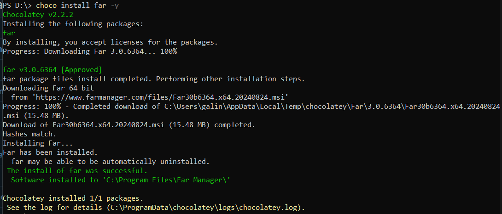{ #fig:001 width=70% }

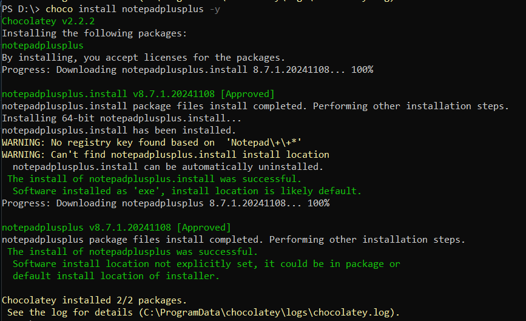{ #fig:002 width=70% }

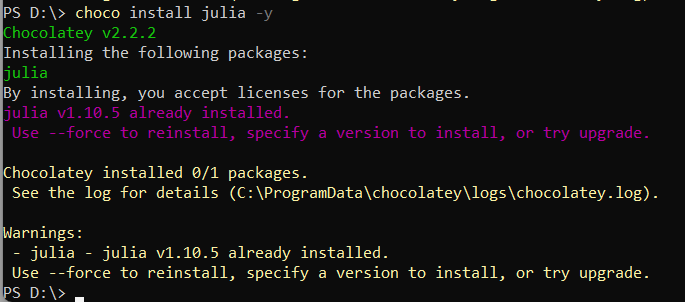{ #fig:003 width=70% }

**3.** После установки запуститила Julia врежиме REPL. Перешла в пакетный режим Julia и ввела  add IJulia для установки пакета для работы с Jupyter. (рис. [-@fig:004])

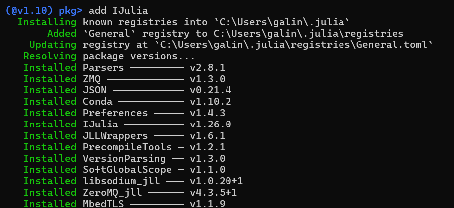{ #fig:004 width=70% }

**4.** Я буду использовать Jupyter Lab. Перешла через Anaconda в Jupyter Lab и создала новый блокнот.

**5.** Перешла к следующему пункту задания. Нужно было повторить ппримеры осно синтаксиса Julia. (Некоторые комментарии есть на скриншотах в блокноте)

- Определение типа числовой величины. (рис. [-@fig:005])

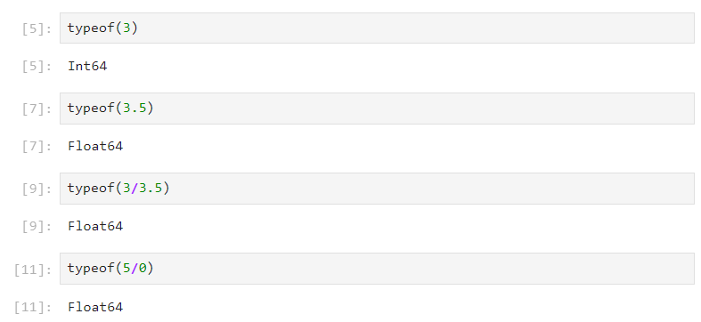{ #fig:005 width=70% }

- Определение крайних значений диапазонов целочисленных числовых величин. (рис. [-@fig:006])

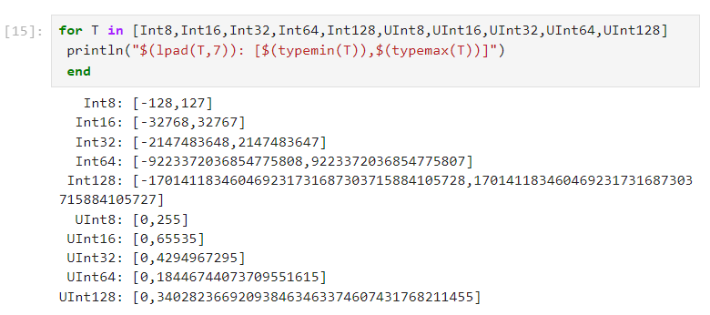{ #fig:006 width=70% }

- Преобразование типов. (рис. [-@fig:007])

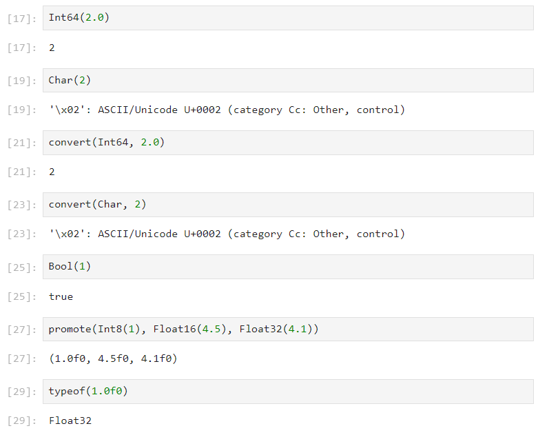{ #fig:007 width=70% }

- Синтаксис определения функций. (рис. [-@fig:008])

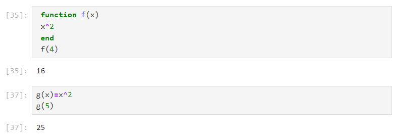{ #fig:008 width=70% }

- Одномерные массивы. (рис. [-@fig:009])

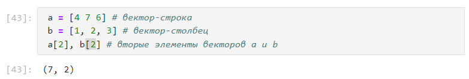{ #fig:009 width=70% }

- Двумерные массивы. (рис. [-@fig:010])

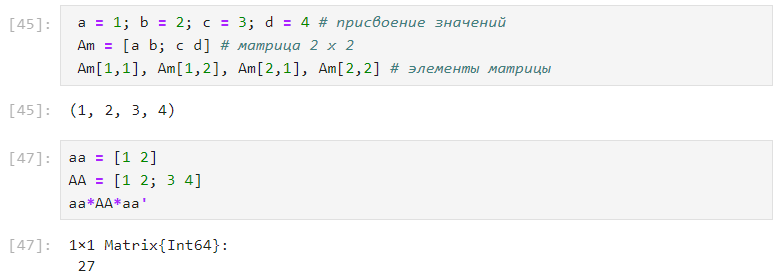{ #fig:010 width=70% }

**6.** Перешла к заданиям для самостоятельной работы. Нужно было изучить документацию по некторорым функциям. Нижу будет функция и пример к ней.

**7.** Функции для чтения/записи/вывода информации:

- write() (рис. [-@fig:011])

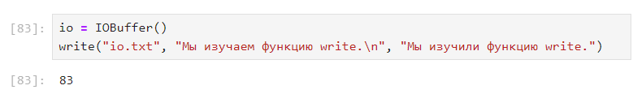{ #fig:011 width=70% }

- read()

- readline()

- readdlm() (рис. [-@fig:011])

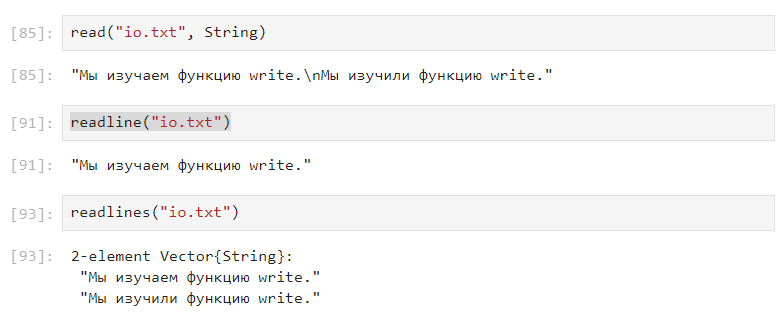{ #fig:012 width=70% }

- print()

- println()

- show() (рис. [-@fig:013])

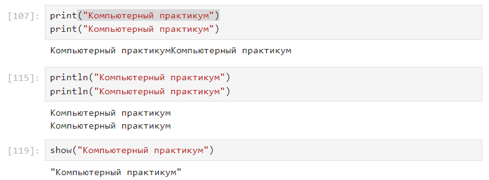{ #fig:013 width=70% }

**8.** Изучила и придумала пример к функции parse(). Эта функция преобразует строковое представление числа в число. (рис. [-@fig:014])

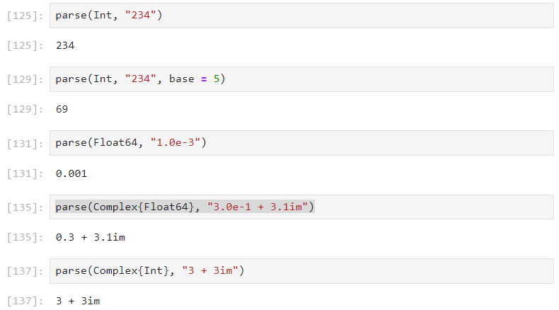{ #fig:014 width=70% }

**9.** Попробовала базовые математические операций с разным типом переменных:сложение,вычитание,умножение,деление,возведение в степень,извлечение корня,сравнение,логические операции. Подробно нет смысла описывать, некоторые комментарии будут на скриншоте. Привела свои примеры. (рис. [-@fig:015]) (рис. [-@fig:016])

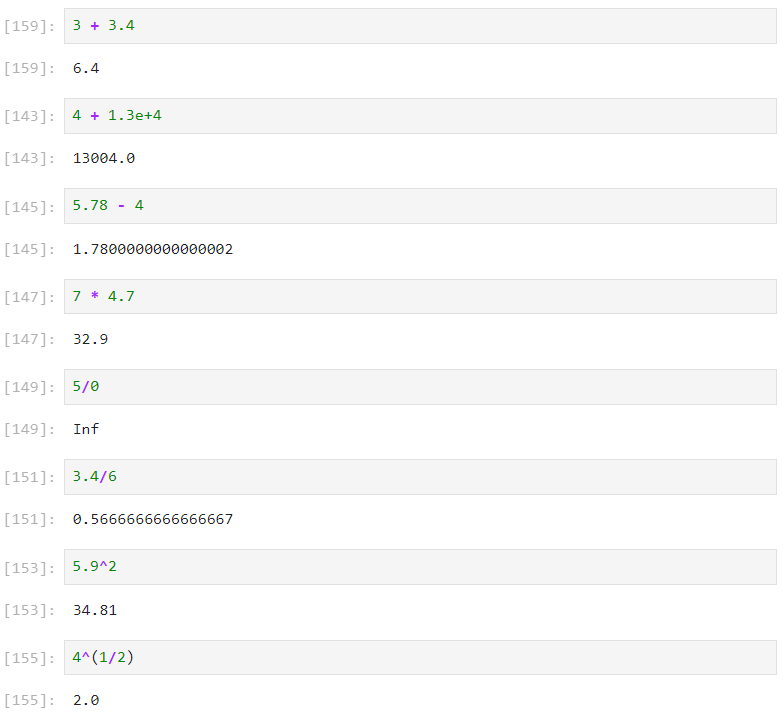{ #fig:015 width=70% }

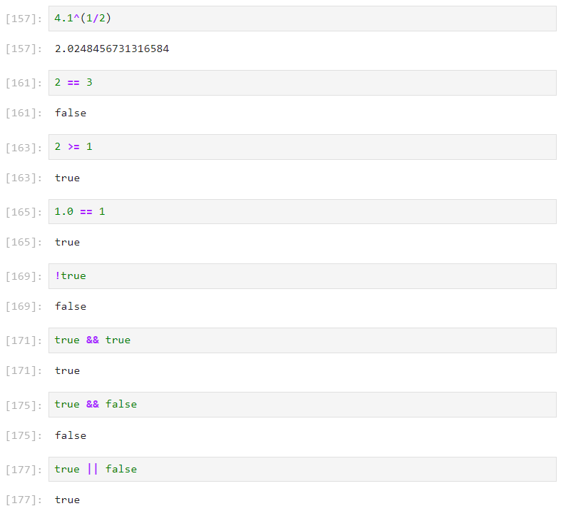{ #fig:016 width=70% }

**10.** Привела примеры операций над матрицами и векторами:  сложение, вычитание, скалярное произведение, транспонирование, умножение наскаляр. (рис. [-@fig:017]) (рис. [-@fig:018])

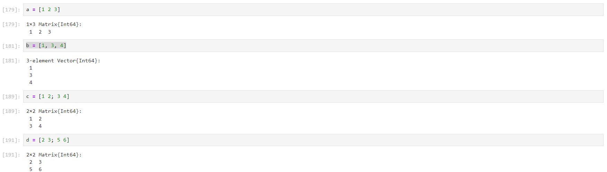{ #fig:017 width=70% }

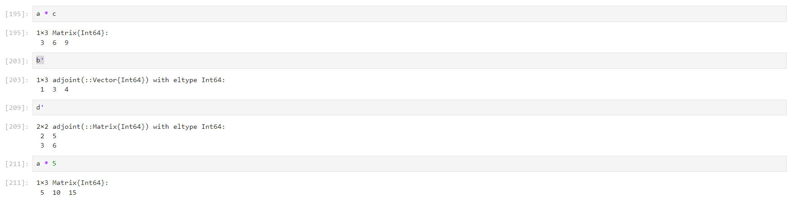{ #fig:018 width=70% }

# Вывод

Подготовила рабочее пространство и инструментарий для работы с языком программирования Julia, на простейших примерах познакомилась с основами синтаксиса Julia.
