---
## Front matter
title: "Отчет по лабораторной работе №2"
subtitle: "Структуры данных"
author: "Легиньких Галина Андреевна"

## Generic otions
lang: ru-RU
toc-title: "Содержание"
## Pdf output format
toc: true # Table of contents
toc-depth: 2
lof: true # List of figures
lot: true # List of tables
fontsize: 12pt
linestretch: 1.5
papersize: a4
documentclass: scrreprt
## I18n polyglossia
polyglossia-lang:
  name: russian
  options:
  - spelling=modern
  - babelshorthands=true
polyglossia-otherlangs:
  name: english
## I18n babel
babel-lang: russian
babel-otherlangs: english
## Fonts
mainfont: PT Serif
romanfont: PT Serif
sansfont: PT Sans
monofont: PT Mono
mainfontoptions: Ligatures=TeX
romanfontoptions: Ligatures=TeX
sansfontoptions: Ligatures=TeX,Scale=MatchLowercase
monofontoptions: Scale=MatchLowercase,Scale=0.9
## Biblatex
biblatex: true
biblio-style: "gost-numeric"
biblatexoptions:
  - parentracker=true
  - backend=biber
  - hyperref=auto
  - language=auto
  - autolang=other*
  - citestyle=gost-numeric
## Pandoc-crossref LaTeX customization
figureTitle: "Рис."
tableTitle: "Таблица"
listingTitle: "Листинг"
lofTitle: "Список иллюстраций"
lotTitle: "Список таблиц"
lolTitle: "Листинги"
## Misc options
indent: true
header-includes:
  - \usepackage{indentfirst}
  - \usepackage{float} # keep figures where there are in the text
  - \floatplacement{figure}{H} # keep figures where there are in the text
---

# Цель работы

Основная цель работы — изучить несколько структур данных, реализованных в Julia, научиться применять их и операции над ними для решения задач.

# Задание

1. Используя Jupyter Lab, повторите примеры из раздела 2.2.
2. Выполните задания для самостоятельной работы (раздел 2.4).

# Выполнение лабораторной работы

**1.** Для начала я повторила все примеры из документа. В начале был дан перечень функций (методов), которые я использовала при повторении примеров. (рис. [-@fig:001])

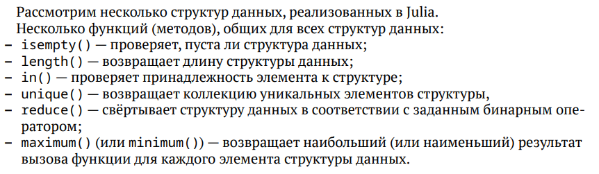{ #fig:001 width=70% }

**2.** Рассмотрела примеры кортежей. Комментарии ко всем примерам на скриншотах. (рис. [-@fig:002])

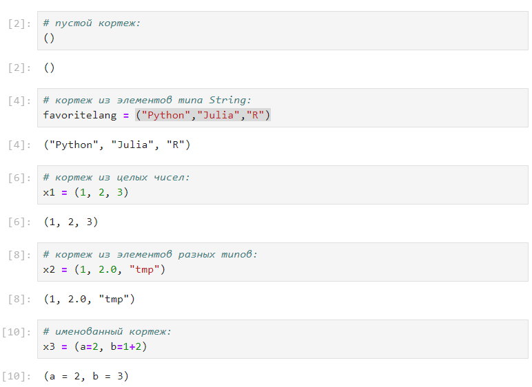{ #fig:002 width=70% }

**3.** Повторила примеры операция над кортежами. (рис. [-@fig:003])

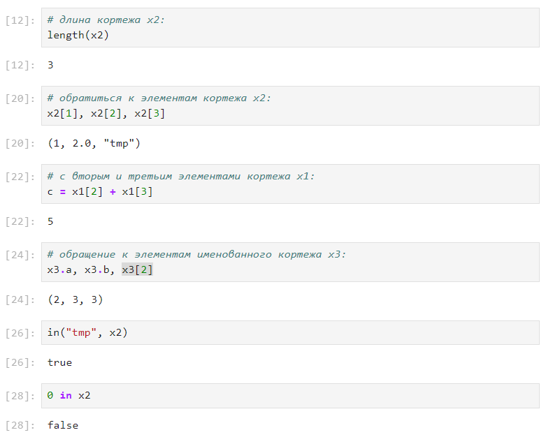{ #fig:003 width=70% }

**4.** Перешла к словарям и операциями над ними. Повторила примеры операция над словарями. (рис. [-@fig:004]) (рис. [-@fig:005])

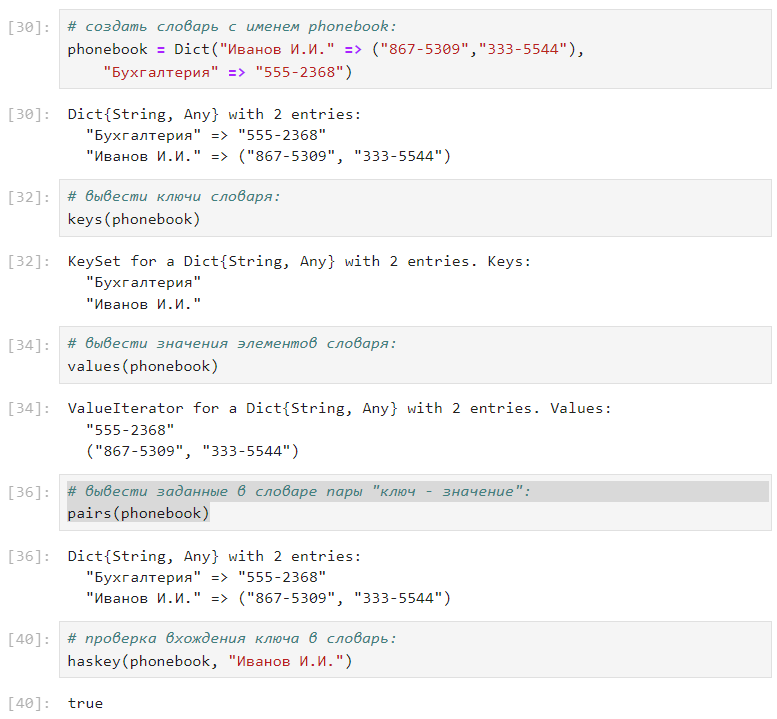{ #fig:004 width=70% }

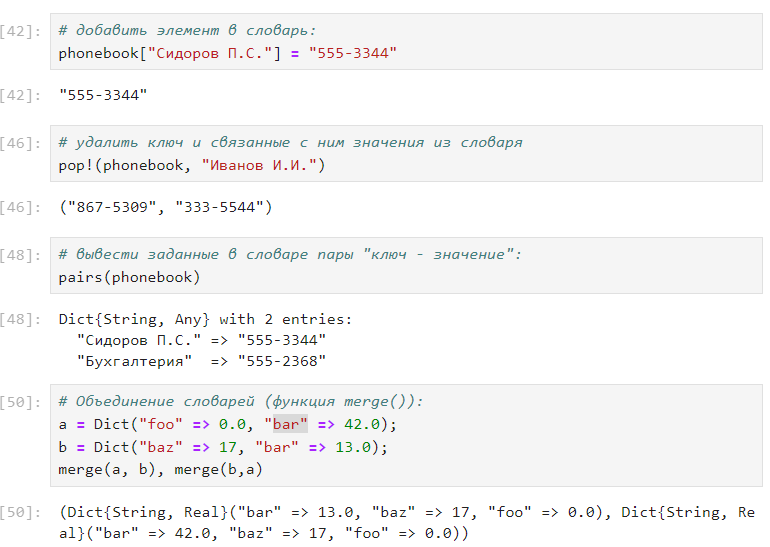{ #fig:005 width=70% }

**5.** Далее множества и операции над ними. (рис. [-@fig:006]) (рис. [-@fig:007]) (рис. [-@fig:008])

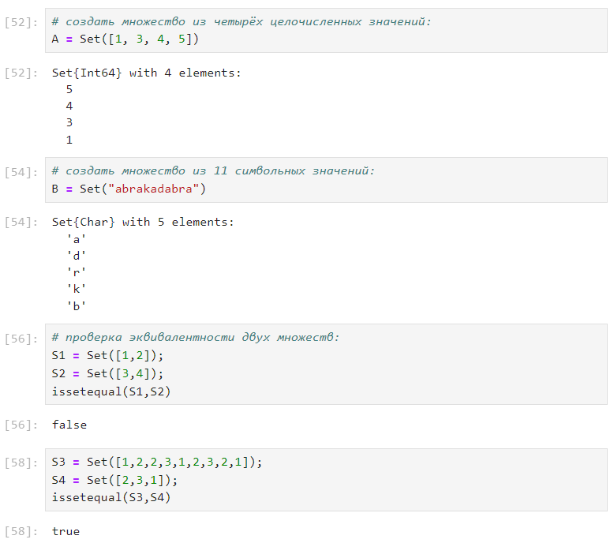{ #fig:006 width=70% }

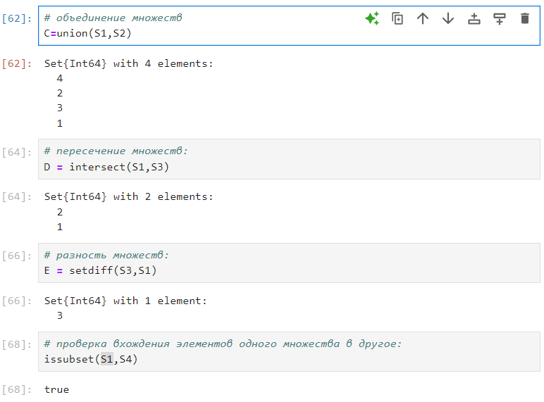{ #fig:007 width=70% }

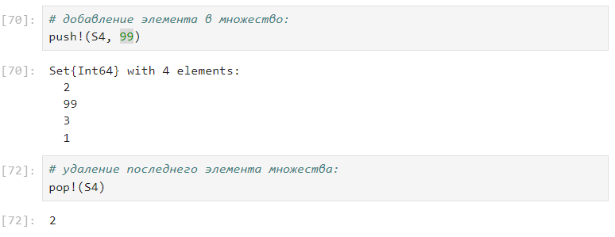{ #fig:008 width=70% }

**6.** Повторила примеры массивов и операции для работы с ними. (рис. [-@fig:009]) (рис. [-@fig:010]) (рис. [-@fig:011]) (рис. [-@fig:012]) (рис. [-@fig:013]) (рис. [-@fig:014]) (рис. [-@fig:015]) (рис. [-@fig:016])

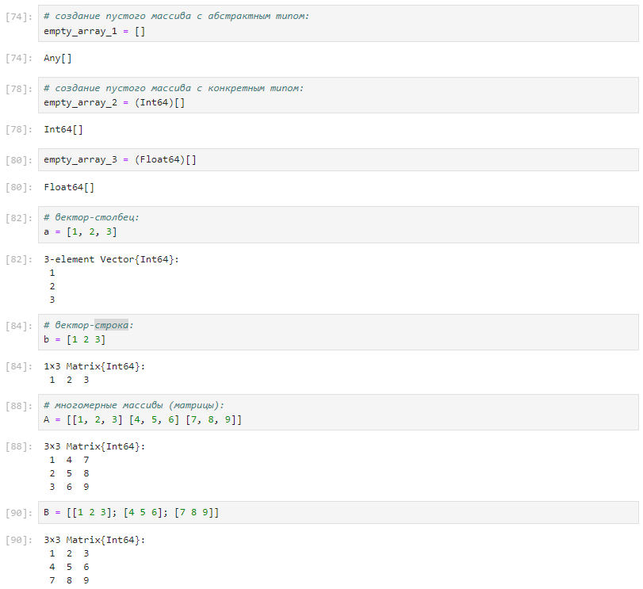{ #fig:009 width=70% }

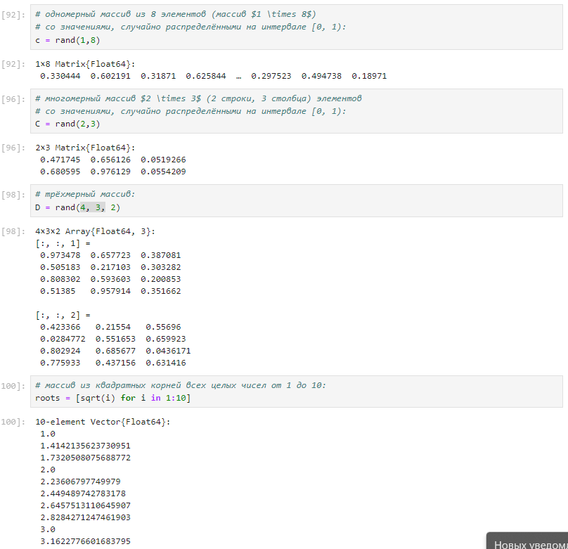{ #fig:010 width=70% }

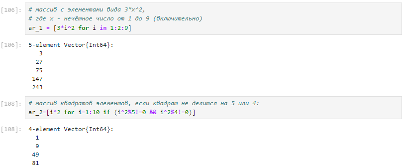{ #fig:011 width=70% }

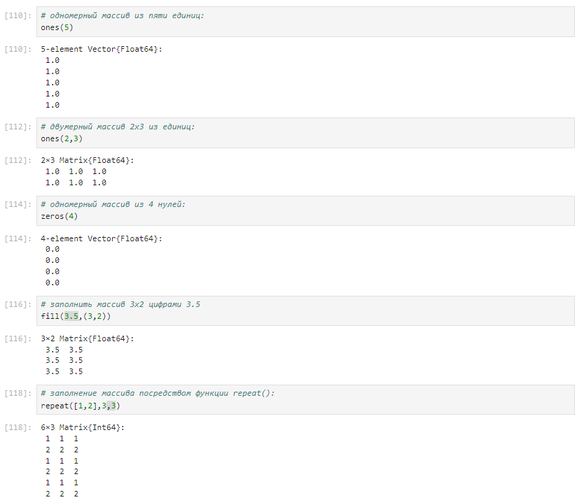{ #fig:012 width=70% }

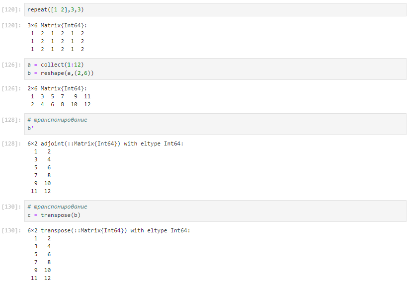{ #fig:013 width=70% }

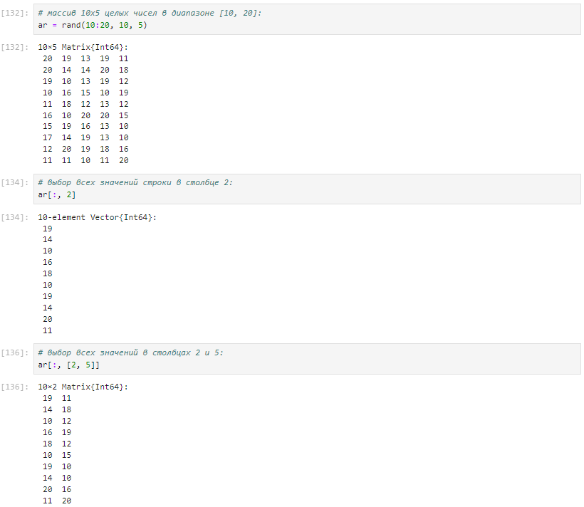{ #fig:014 width=70% }

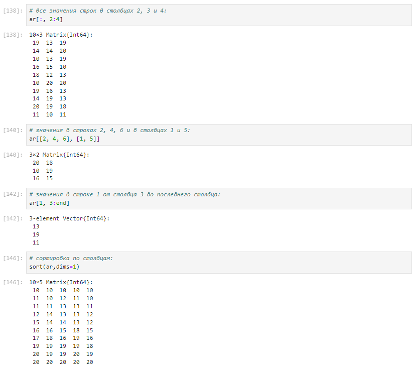{ #fig:015 width=70% }

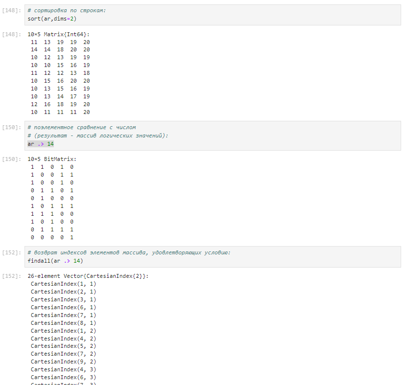{ #fig:016 width=70% }

**7.** Перешла к выполнению самостоятельных заданий. Дублировать сами задания я не буду, это масимально проблематично. Я просто буду придерживаться их нумерации. Все объяснения в видео выполнение.

- Задание 1:

Даны множества:  
\(𝐴 = \{0, 3, 4, 9\}\),  
\(𝐵 = \{1, 3, 4, 7\}\),  
\(𝐶 = \{0, 1, 2, 4, 7, 8, 9\}\).  

Найти:
\[
𝑃 = 𝐴 ∩ 𝐵 ∪ 𝐴 ∩ 𝐵 ∪ 𝐴 ∩ 𝐶 ∪ 𝐵 ∩ 𝐶.
\]

Задание 2: риведите свои примеры с выполнением операций над множествами элементов разных типов. (рис. [-@fig:017])

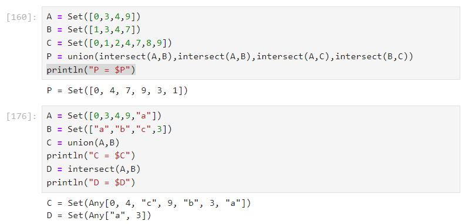{ #fig:017 width=70% }

- Задания 3.1 - 3.5:

Создайте разными способами массивы:

1. Массив \((1, 2, 3, …, 𝑁 − 1, 𝑁 )\), \(𝑁\) выберите больше 20.
2. Массив \((𝑁, 𝑁 − 1, …, 2, 1)\), \(𝑁\) выберите больше 20.
3. Массив \((1, 2, 3, …, 𝑁 − 1, 𝑁, 𝑁 − 1, …, 2, 1)\), \(𝑁\) выберите больше 20.
4. Массив с именем `tmp` вида \((4, 6, 3)\).
5. Массив, в котором первый элемент массива `tmp` повторяется 10 раз.
(рис. [-@fig:018])

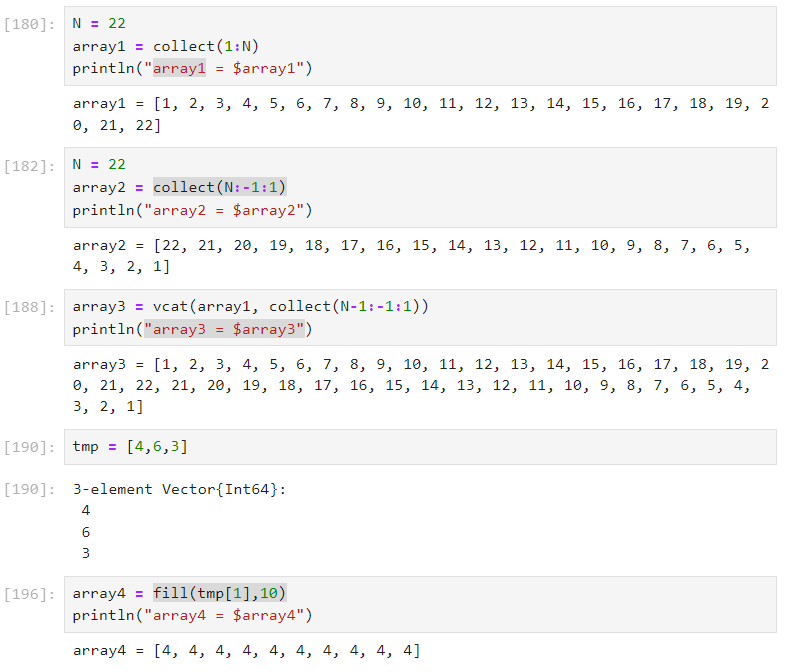{ #fig:018 width=70% }

- Задания 3.6 - 3.10:

6. Массив, в котором все элементы массива `tmp` повторяются 10 раз.
7. Массив, в котором первый элемент массива `tmp` встречается 11 раз, второй элемент — 10 раз, третий элемент — 10 раз.
8. Массив, в котором первый элемент массива `tmp` встречается 10 раз подряд, второй элемент — 20 раз подряд, третий элемент — 30 раз подряд.
9. Массив из элементов вида \(2^{tmp[i]}\), \(i = 1, 2, 3\), где элемент \(2^{tmp[3]}\) встречается 4 раза. Посчитайте в полученном векторе, сколько раз встречается цифра 6, и выведите это значение на экран.
10. Вектор значений \(𝑦 = 𝑒^𝑥 \cos(𝑥)\) в точках \(𝑥 = 3, 3.1, 3.2, … , 6\). Найдите среднее значение \(𝑦\).
(рис. [-@fig:019])

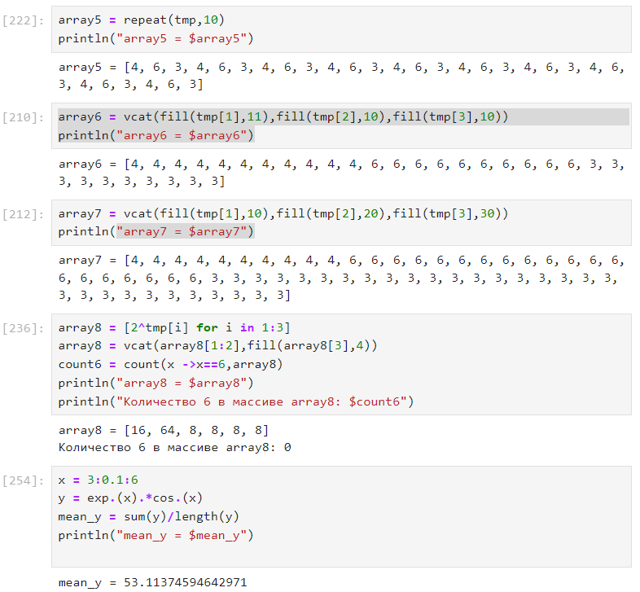{ #fig:019 width=70% }

- Задание 3.11:

Вектор вида \((𝑥𝑖, 𝑦𝑗)\), где:
    - \(𝑥 = 0.1\), \(𝑖 = 3, 6, 9, … , 36\),
    - \(𝑦 = 0.2\), \(𝑗 = 1, 4, 7, … , 34\). (рис. [-@fig:020])

{ #fig:020 width=70% }

- Задания 3.12 - 3.13:

12. Вектор с элементами \(\frac{2^i}{i}\), \(i = 1, 2, … , 𝑀\), \(𝑀 = 25\).
13. Вектор вида \(("fn1", "fn2", …, "fnN")\), \(𝑁 = 30\). 
(рис. [-@fig:021])

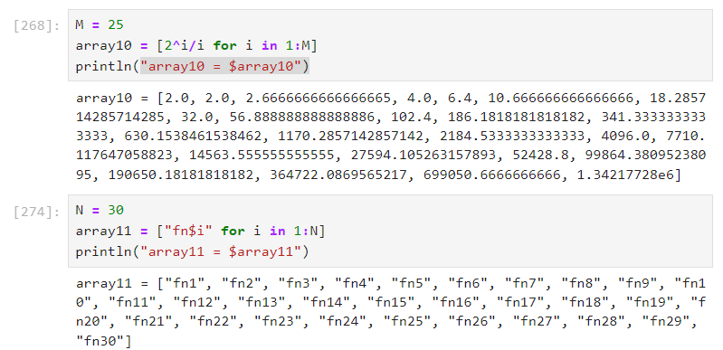{ #fig:021 width=70% }

- Задание 3.14.1:

Векторы \(𝑥 = (𝑥_1, 𝑥_2, … , 𝑥_𝑛)\) и \(𝑦 = (𝑦_1, 𝑦_2, … , 𝑦_𝑛)\) целочисленного типа длины \(𝑛 = 250\) как случайные выборки из совокупности \(\{0, 1, … , 999\}\). На их основе:

- Сформируйте вектор \((𝑦_2 − 𝑥_1, … , 𝑦_𝑛 − 𝑥_{𝑛−1})\). (рис. [-@fig:022])

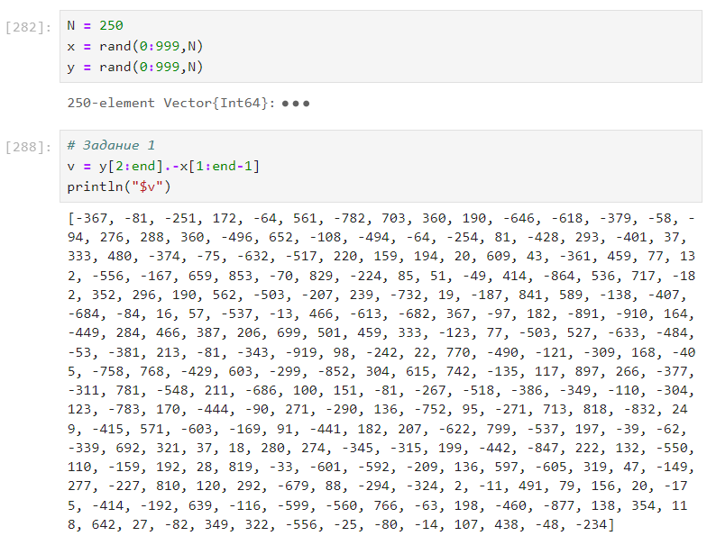{ #fig:022 width=70% }

- Задание 3.14.2:

- Сформируйте вектор \((𝑥_1 + 2𝑥_2 − 𝑥_3, 𝑥_2 + 2𝑥_3 − 𝑥_4, … , 𝑥_{𝑛−2} + 2𝑥_{𝑛−1} − 𝑥_𝑛)\). (рис. [-@fig:023])

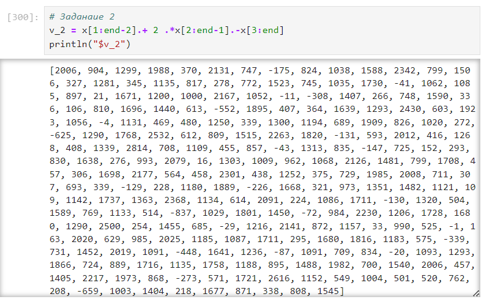{ #fig:023 width=70% }

- Задание 3.14.3:

- Сформируйте вектор \((\frac{\sin(𝑦_1)}{\cos(𝑥_2)}, \frac{\sin(𝑦_2)}{\cos(𝑥_3)}, … , \frac{\sin(𝑦_{𝑛−1})}{\cos(𝑥_𝑛)})\). (рис. [-@fig:024])

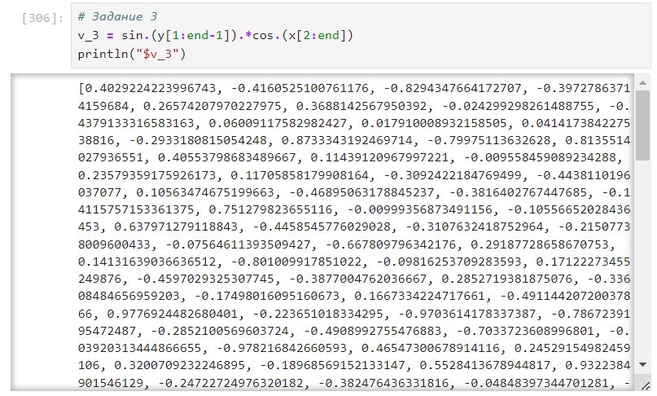{ #fig:024 width=70% }

- Задание 3.14.4 - 3.14.5:

- Вычислите \(\sum_{𝑖=1}^{𝑛−1} \frac{𝑒^{−𝑥_{𝑖+1}}}{𝑥_𝑖 + 10}\).
- Выберите элементы вектора \(𝑦\), значения которых больше 600, и выведите на экран. Определите индексы этих элементов.  (рис. [-@fig:025])

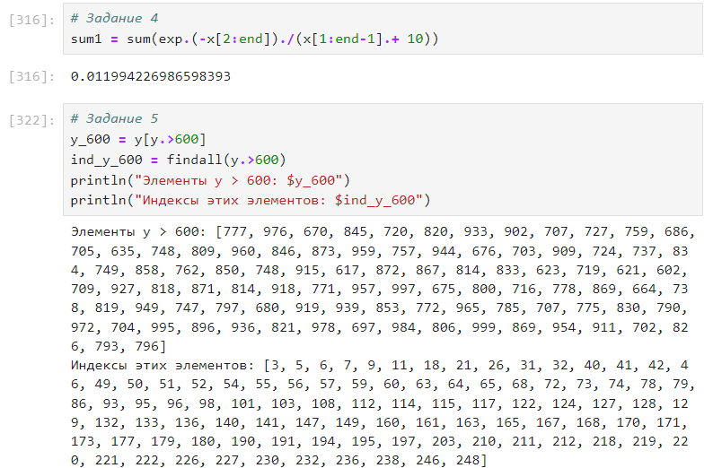{ #fig:025 width=70% }

- Задание 3.14.6 - 3.14.7:

- Сформируйте вектор \((|𝑥_1 − 𝑥|^{1/2}, |𝑥_2 − 𝑥|^{1/2}, … , |𝑥_𝑛 − 𝑥|^{1/2})\), где \(𝑥\) обозначает среднее значение вектора \(𝑥 = (𝑥_1, 𝑥_2, … , 𝑥_𝑛)\).  (рис. [-@fig:026])
- Определите, сколько элементов вектора \(𝑦\) отстоят от максимального значения не более, чем на 200.  
(рис. [-@fig:026])

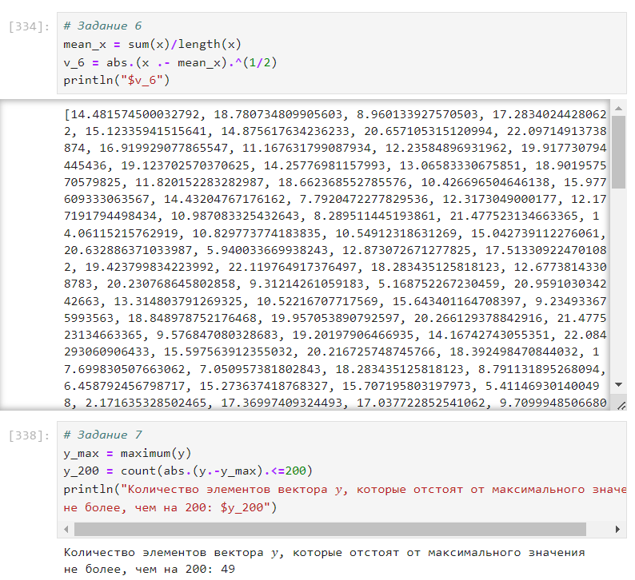{ #fig:026 width=70% }

- Задание 3.14.8 - 3.14.10:

- Определите, сколько чётных и нечётных элементов вектора \(𝑥\).  
- Определите, сколько элементов вектора \(𝑥\) кратны 7. 
- Отсортируйте элементы вектора \(𝑥\) в порядке возрастания элементов вектора \(𝑦\).  (рис. [-@fig:027])

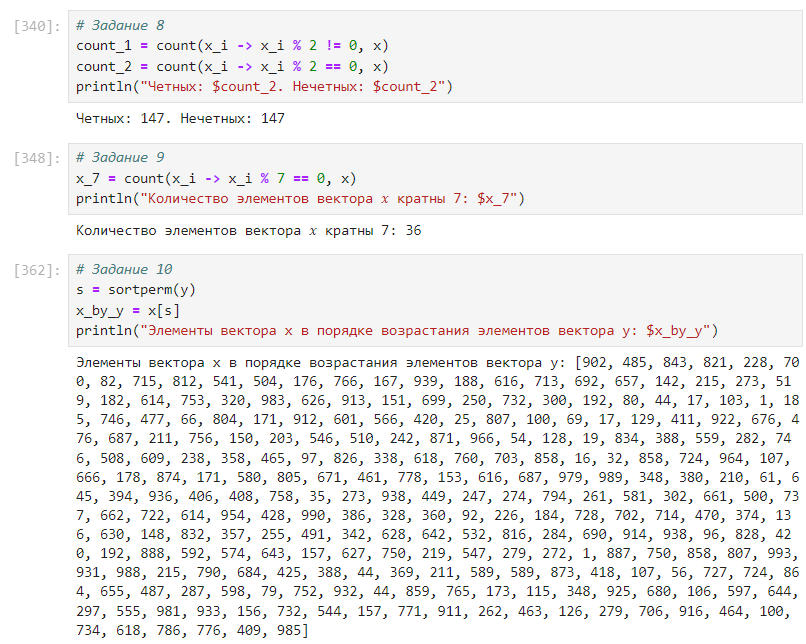{ #fig:027 width=70% }

- Задание 3.14.11 - 3.14.12:

- Выведите элементы вектора \(𝑥\), которые входят в десятку наибольших (top-10).  
- Сформируйте вектор, содержащий только уникальные (неповторяющиеся) элементы вектора \(𝑥\).
(рис. [-@fig:028])

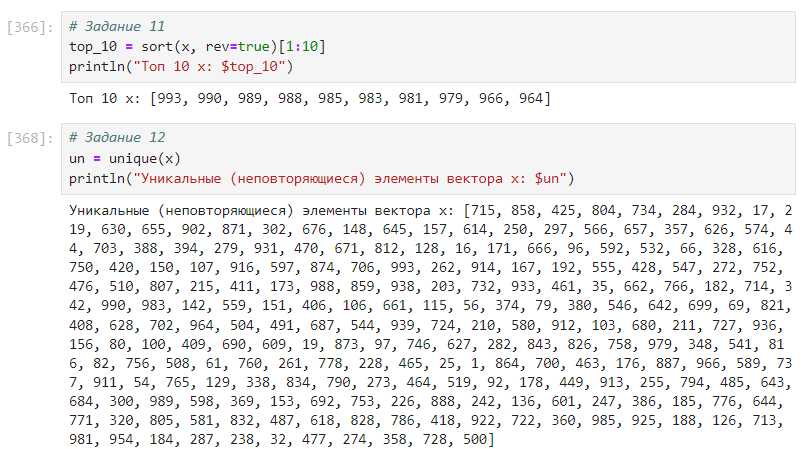{ #fig:028 width=70% }

- Задание 4: 

Создайте массив `squares`, в котором будут храниться квадраты всех целых чисел от 1 до 100.
(рис. [-@fig:029])

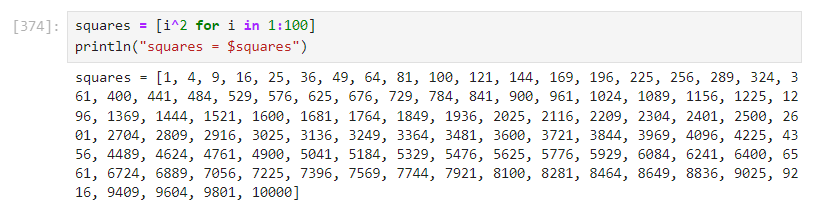{ #fig:029 width=70% }

- Задание 5:

Подключите пакет `Primes` (функции для вычисления простых чисел).  
- Сгенерируйте массив `myprimes`, в котором будут храниться первые 168 простых чисел.  
- Определите 89-е наименьшее простое число.  
- Получите срез массива с 89-го до 99-го элемента включительно, содержащий наименьшие простые числа. (рис. [-@fig:030])

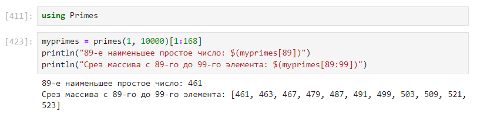{ #fig:030 width=70% }

- Задание 6:

Вычислите следующие выражения:
1. \[
\sum_{𝑖=10}^{100} (𝑖^3 + 4𝑖^2)
\]
2. \[
\sum_{𝑖=1}^{𝑀} \left( \frac{2^𝑖}{𝑖} + \frac{3^𝑖}{𝑖^2} \right), \, 𝑀 = 25
\]
3. \[
1 + \frac{2}{3} + \frac{2 \cdot 3}{4 \cdot 5} + \frac{2 \cdot 3 \cdot 4}{5 \cdot 6 \cdot 7} + \dots + \frac{2 \cdot 3 \cdot 4 \cdots 38}{39}
\]
(рис. [-@fig:031])

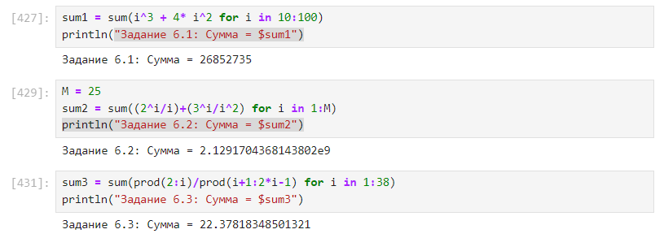{ #fig:031 width=70% }

# Вывод

Изучила несколько структур данных, реализованных в Julia, научилась применять их и операции над ними для решения задач.