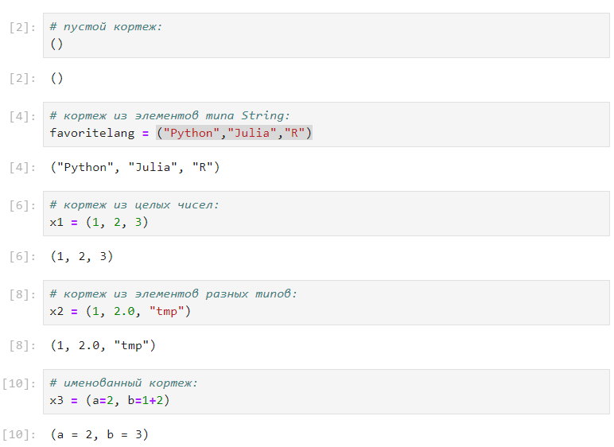
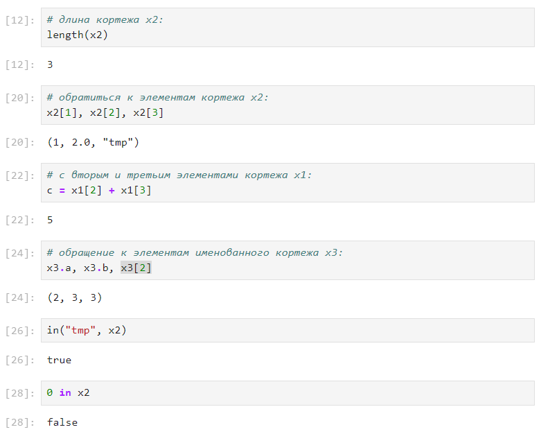
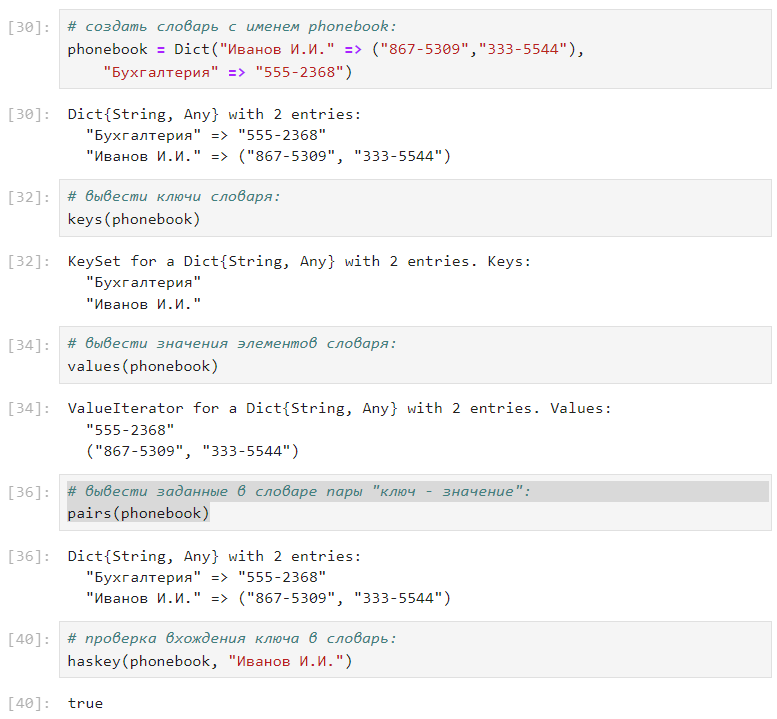
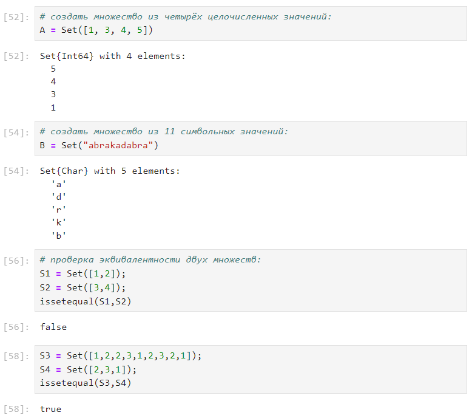
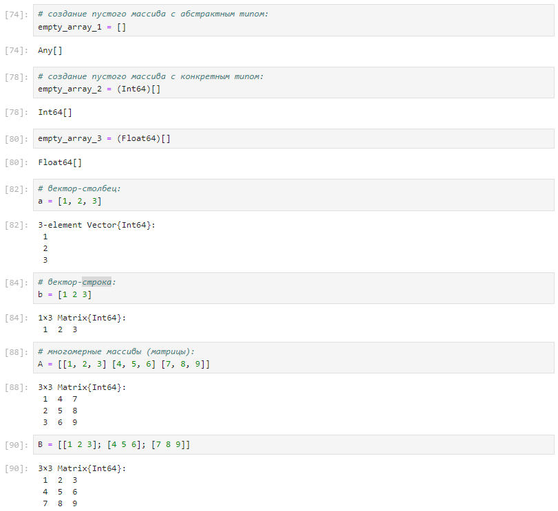
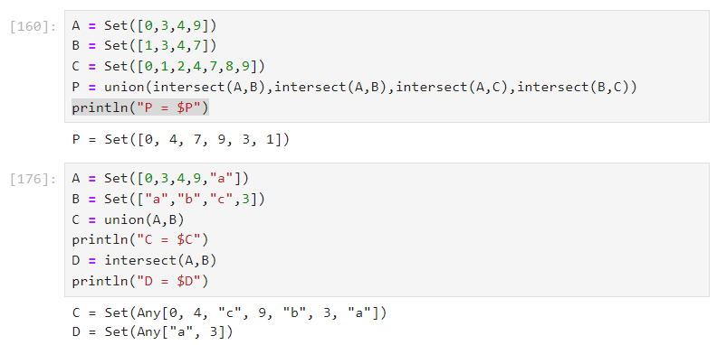
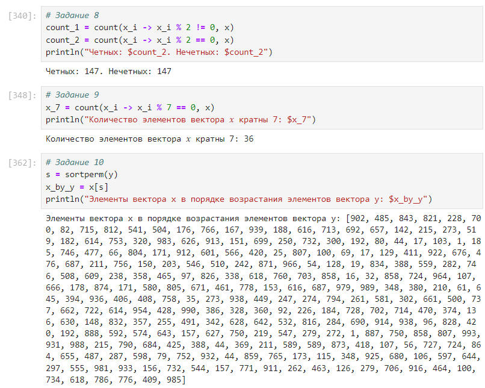
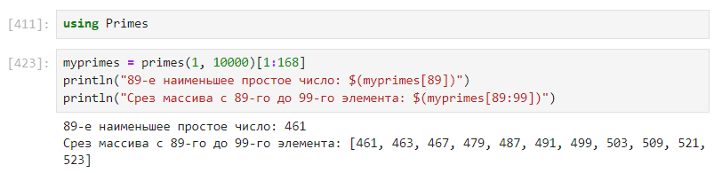

---
## Front matter
lang: ru-RU
title: Лабораторная работа №2
subtitle: "Структуры данных"
author:
  - Легиньких Г.А.
institute:
  - Российский университет дружбы народов, Москва, Россия

## i18n babel
babel-lang: russian
babel-otherlangs: english

## Formatting pdf
toc: false
toc-title: Содержание
slide_level: 2
aspectratio: 169
section-titles: true
theme: metropolis
header-includes:
 - \metroset{progressbar=frametitle,sectionpage=progressbar,numbering=fraction}
 - '\makeatletter'
 - '\beamer@ignorenonframefalse'
 - '\makeatother'
---

# Информация

## Докладчик

:::::::::::::: {.columns align=center}
::: {.column width="70%"}

  * Легиньких Галина Андреевна
  * НФИбд-02-21
  * Российский университет дружбы народов
  * [1032216447@pfur.ru](mailto:1032216447@pfur.ru)
  * <https://github.com/galeginkikh>

:::
::: {.column width="30%"}

:::
::::::::::::::

# Основная информация

## Цель работы

Основная цель работы — изучить несколько структур данных, реализованных в Julia, научиться применять их и операции над ними для решения задач. 

## Задание

1. Используя Jupyter Lab, повторите примеры из раздела 2.2.
2. Выполните задания для самостоятельной работы (раздел 2.4).

# Выполнение

## Кортежи

Повторила примеры из документа

{ #fig:002 width=70% }

## Кортежи

{ #fig:003 width=50% }

## Словари

Далее перешла к словарям

{ #fig:004 width=50% }

## Множества

Множества и операции над ними

{ #fig:006 width=50% }

## Массивы

Повторила примеры из документа

{ #fig:009 width=50% }

## Самостоятельное задание

Перешла к выполнению самостоятельных заданий. Дублировать все задания я не буду, они есть в отчете и их много. Я просто буду придерживаться их нумерации. Объясню по одному примеру на каждый вид структур.

## Задание 1 и 2

Это работа с множествами

{ #fig:017 width=60% }

## Задание 3.12 - 3.13

Это работа с массивами

- Задания 3.12 - 3.13 (рис. [-@fig:021])

## Задание 3.8 - 3.10

{ #fig:027 width=50% }

## Задание 5

Это работа с пакетом Primes

{ #fig:030 width=60% }

# Вывод

Изучила несколько структур данных, реализованных в Julia, научилась применять их и операции над ними для решения задач.