---
## Front matter
title: "Отчет по лабораторной работе №4"
subtitle: "Линейная алгебра"
author: "Легиньких Галина Андреевна"

## Generic otions
lang: ru-RU
toc-title: "Содержание"
## Pdf output format
toc: true # Table of contents
toc-depth: 2
lof: true # List of figures
lot: true # List of tables
fontsize: 12pt
linestretch: 1.5
papersize: a4
documentclass: scrreprt
## I18n polyglossia
polyglossia-lang:
  name: russian
  options:
  - spelling=modern
  - babelshorthands=true
polyglossia-otherlangs:
  name: english
## I18n babel
babel-lang: russian
babel-otherlangs: english
## Fonts
mainfont: PT Serif
romanfont: PT Serif
sansfont: PT Sans
monofont: PT Mono
mainfontoptions: Ligatures=TeX
romanfontoptions: Ligatures=TeX
sansfontoptions: Ligatures=TeX,Scale=MatchLowercase
monofontoptions: Scale=MatchLowercase,Scale=0.9
## Biblatex
biblatex: true
biblio-style: "gost-numeric"
biblatexoptions:
  - parentracker=true
  - backend=biber
  - hyperref=auto
  - language=auto
  - autolang=other*
  - citestyle=gost-numeric
## Pandoc-crossref LaTeX customization
figureTitle: "Рис."
tableTitle: "Таблица"
listingTitle: "Листинг"
lofTitle: "Список иллюстраций"
lotTitle: "Список таблиц"
lolTitle: "Листинги"
## Misc options
indent: true
header-includes:
  - \usepackage{indentfirst}
  - \usepackage{float} # keep figures where there are in the text
  - \floatplacement{figure}{H} # keep figures where there are in the text
---

# Цель работы

Основной целью работы является изучение возможностей специализированных пакетов Julia для выполнения и оценки эффективности операций над объектами линейной алгебры.

# Задание

1. Используя Jupyter Lab, повторите примеры из раздела 4.2.
2. Выполните задания для самостоятельной работы (раздел 4.4).

# Выполнение лабораторной работы

**1.** Для начала рассмотрела тему "Поэлементные операции над многомерными массивами".

Примеры поэлементной суммы. (рис. [-@fig:001])

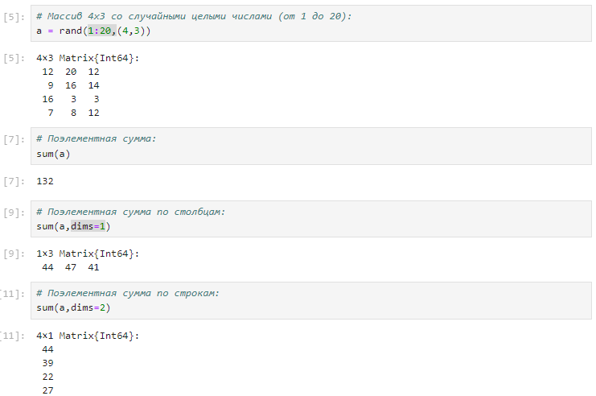{ #fig:001 width=70% }

Так же повторила примеры поэлементного произведения. (рис. [-@fig:002])

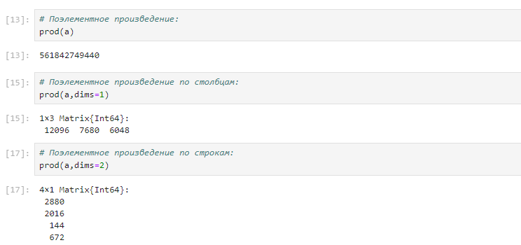{ #fig:002 width=70% }

Для работы со средними значениями можно воспользоваться возможностями пакета Statistics: (рис. [-@fig:003])

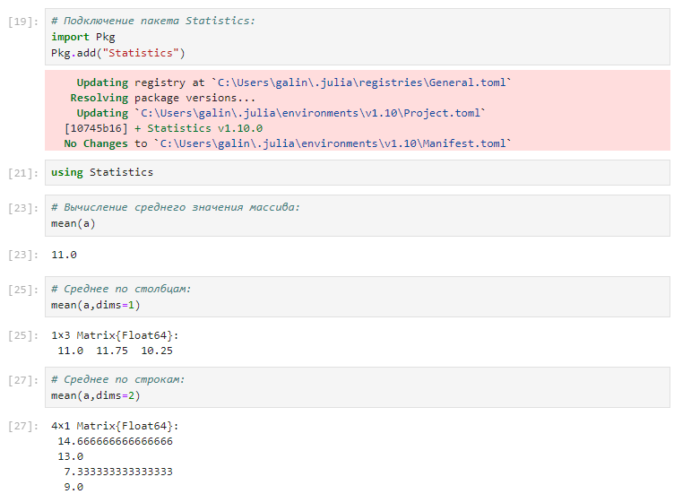{ #fig:003 width=70% }

**2.** Далее перешла к рассмотрению примеров по теме "Транспонирование, след, ранг, определитель и инверсия матрицы".

Для выполнения таких операций над матрицами, как транспонирование, диагонализация, определение следа, ранга, определителя матрицы и т.п. можно воспользоваться библиотекой (пакетом) LinearAlgebra: (рис. [-@fig:004]) (рис. [-@fig:005])

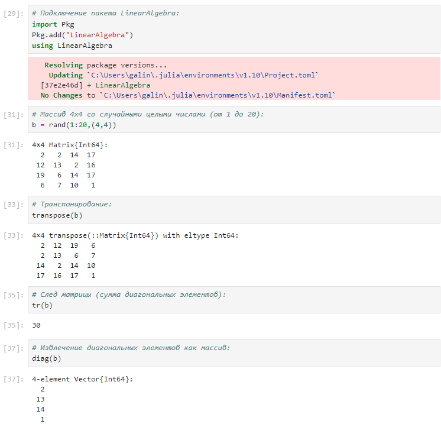{ #fig:004 width=70% }

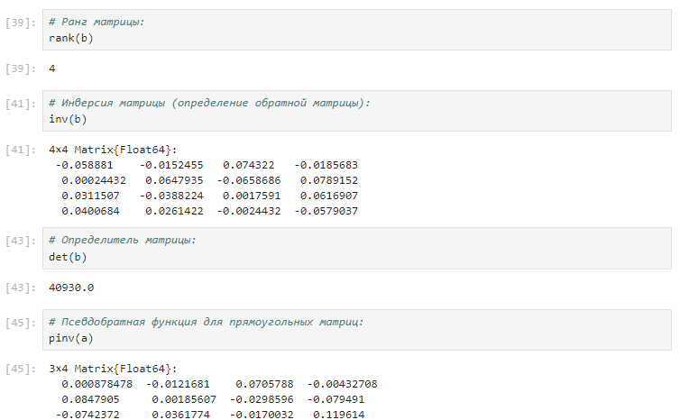{ #fig:005 width=70% }

**3.** Перешла к разделу "Вычисление нормы векторов и матриц, повороты, вращения".

Вычисление евклидовой нормы и p-нормы. (рис. [-@fig:006])

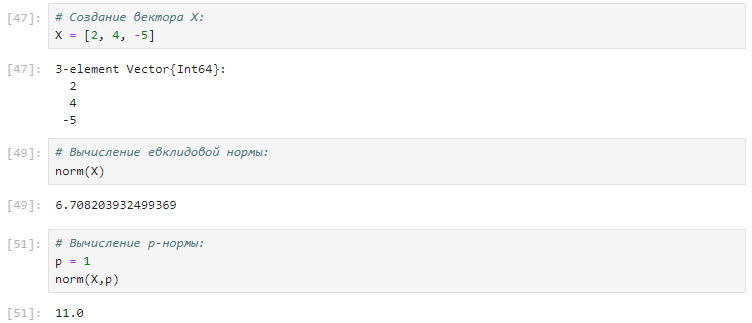{ #fig:006 width=70% }

Расстояние и угол между двумя векторами X и Y. (рис. [-@fig:007])

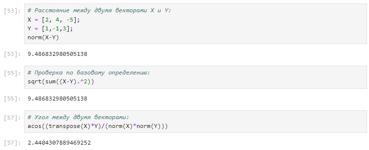{ #fig:007 width=70% }

Вычисление нормы для двумерной матрицы: (рис. [-@fig:008])

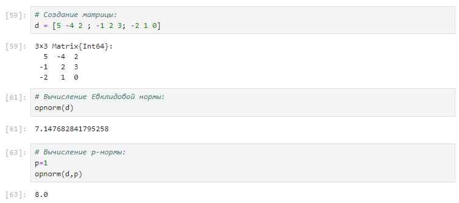{ #fig:008 width=70% }

Повороты матриц. (рис. [-@fig:009])

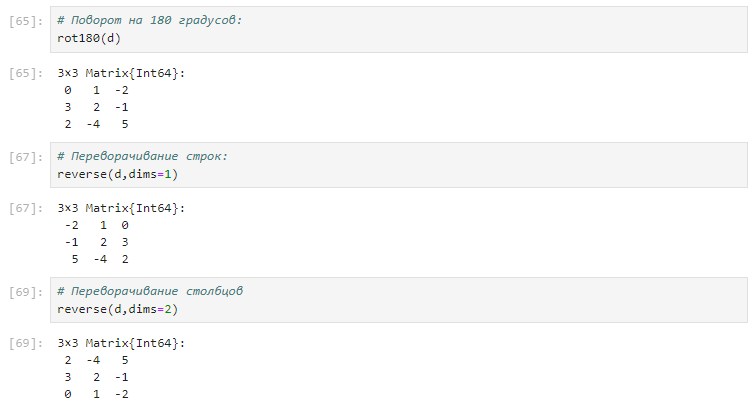{ #fig:009 width=70% }

**4.** Разобрала примеры раздела " Матричное умножение, единичная матрица, скалярное произведение".

Произведение матриц A и B: (рис. [-@fig:010])

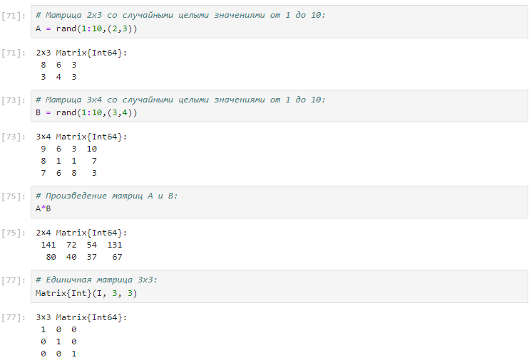{ #fig:010 width=70% }

Скалярное произведение векторов X и Y: (рис. [-@fig:011])

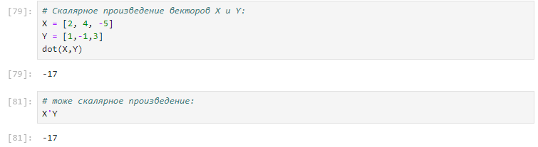{ #fig:011 width=70% }

**5.** Далее тема "Факторизация. Специальные матричные структуры".

Решение систем линейный алгебраических уравнений 𝐴𝑥 = 𝑏: (рис. [-@fig:012])

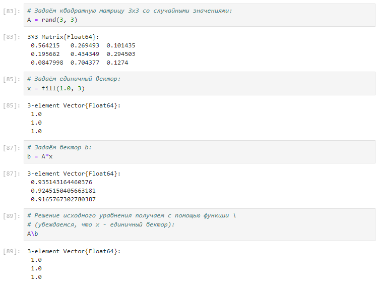{ #fig:012 width=70% }

Julia позволяет вычислять LU-факторизацию и определяет составной тип факторизации для его хранения: (рис. [-@fig:013])

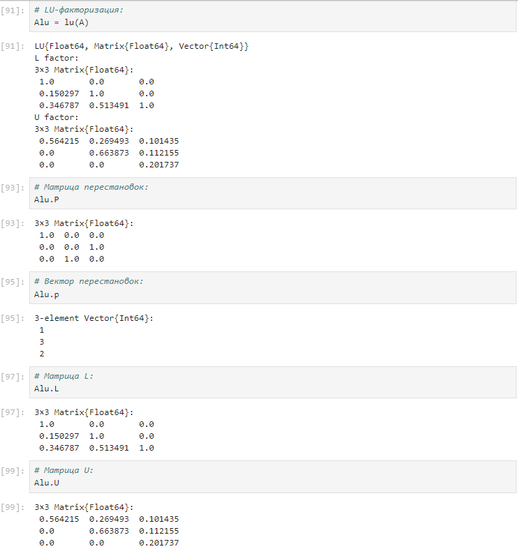{ #fig:013 width=70% }

Исходная система уравнений 𝐴𝑥 = 𝑏 может быть решена или с использованием исходной матрицы, или с использованием объекта факторизации: (рис. [-@fig:014])

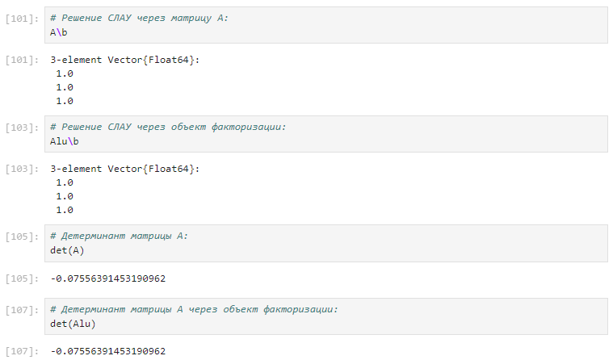{ #fig:014 width=70% }

Julia позволяет вычислять QR-факторизацию и определяет составной тип факторизации для его хранения: (рис. [-@fig:015])

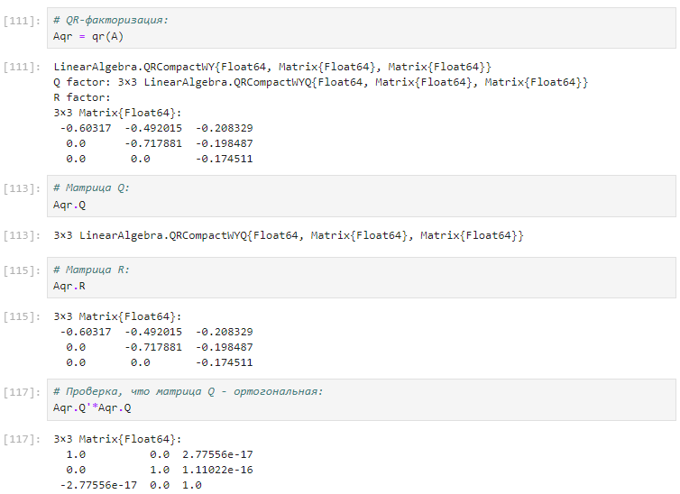{ #fig:015 width=70% }

Примеры собственной декомпозиции матрицы 𝐴: (рис. [-@fig:016])

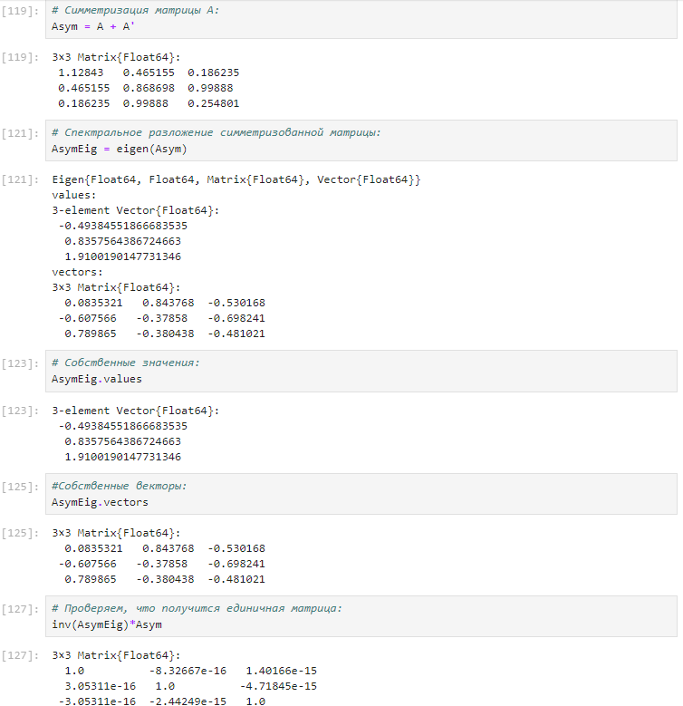{ #fig:016 width=70% }

Далее рассмотрим примеры работы с матрицами большой размерности и специальной структуры. (рис. [-@fig:017])

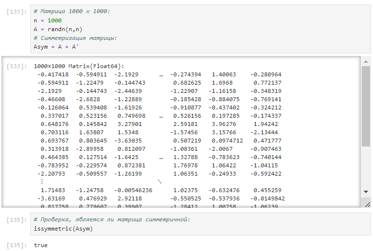{ #fig:017 width=70% }

Пример добавления шума в симметричную матрицу (матрица уже не будет симметричной): (рис. [-@fig:018])

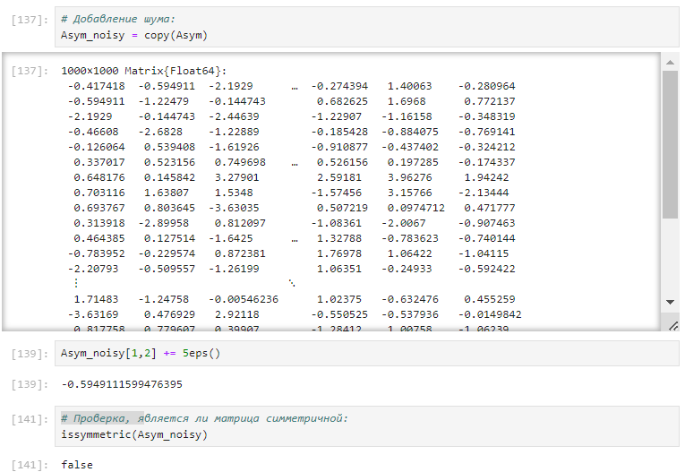{ #fig:018 width=70% }

В Julia можно объявить структуру матрица явно, например, используя Diagonal, Triangular, Symmetric, Hermitian, Tridiagonal и SymTridiagonal: (рис. [-@fig:019])

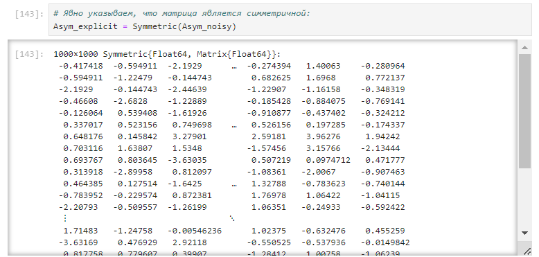{ #fig:019 width=70% }

Далее для оценки эффективности выполнения операций над матрицами большой размерности и специальной структуры воспользуемся пакетом BenchmarkTools: (рис. [-@fig:020])

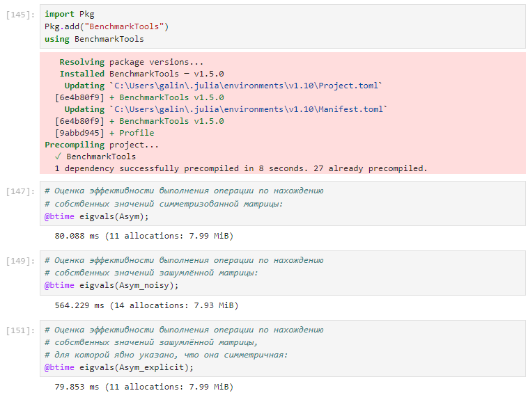{ #fig:020 width=70% }

Использование типов Tridiagonal и SymTridiagonal для хранения трёхдиагональных матриц позволяет работать с потенциально очень большими трёхдиагональными матрицами: (рис. [-@fig:021])

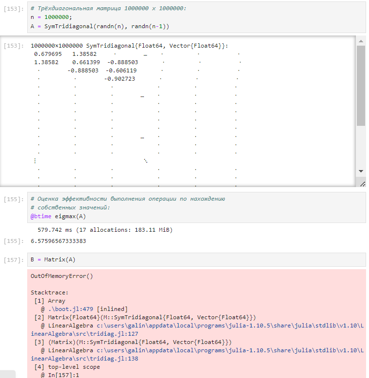{ #fig:021 width=70% }

**6.** Следующий раздел "Общая линейная алгебра".

В следующем примере показано, как можно решить систему линейных уравнений с рациональными элементами без преобразования в типы элементов с плавающей запятой (для избежания проблемы с переполнением используем BigInt): (рис. [-@fig:022]) (рис. [-@fig:023])

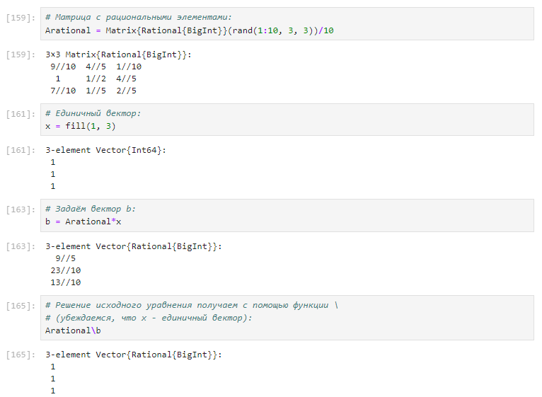{ #fig:022 width=70% }

{ #fig:023 width=70% }

**7.** Перешла к выполнению задания для самостоятельного выполнения. Переписывать задания не буду. Нумерация сохраняется.

- Задание 1.1 - 1.2 (рис. [-@fig:024])

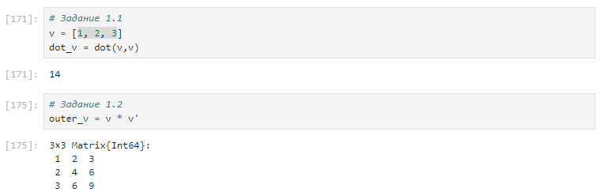{ #fig:024 width=70% }

- Задание 2.1.a - 2.1.e (рис. [-@fig:025])

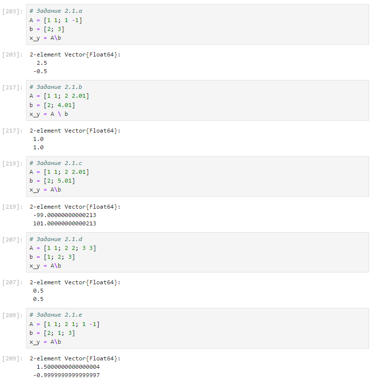{ #fig:025 width=70% }

- Задание 2.1.f (рис. [-@fig:026])

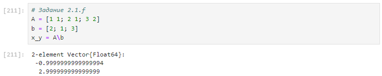{ #fig:026 width=70% }

- Задание 2.2.a - 2.2.d (рис. [-@fig:027])

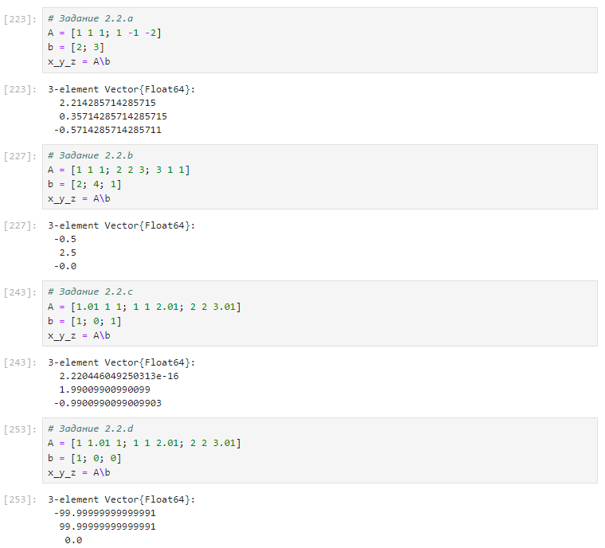{ #fig:027 width=70% }

- Задание 3.1.a - 3.1.c (рис. [-@fig:028])

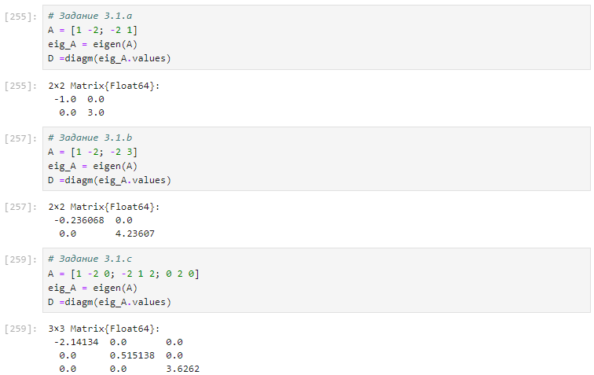{ #fig:028 width=70% }

- Задание 3.2.a - 3.2.d (рис. [-@fig:029])

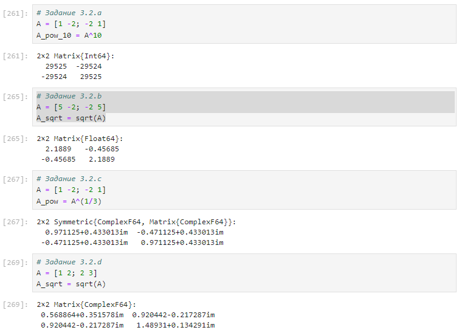{ #fig:029 width=70% }

- Задание 3.3 (рис. [-@fig:030])

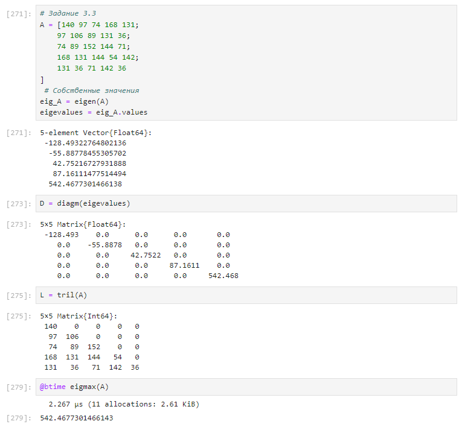{ #fig:030 width=70% }

- Задание 4.1 (рис. [-@fig:031])

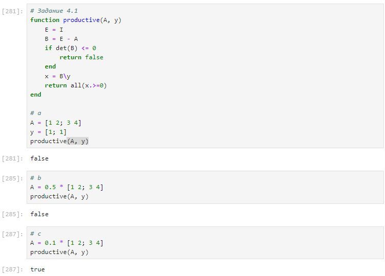{ #fig:031 width=70% }

- Задание 4.2 (рис. [-@fig:032])

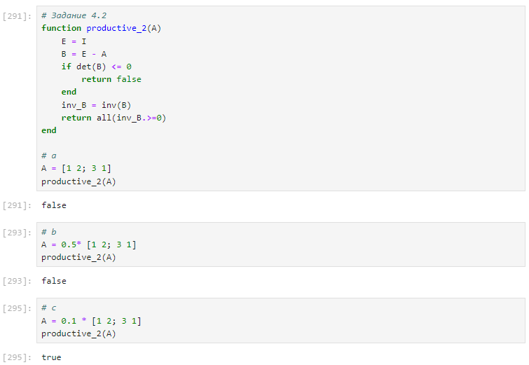{ #fig:032 width=70% }

- Задание 4.3 (рис. [-@fig:033])

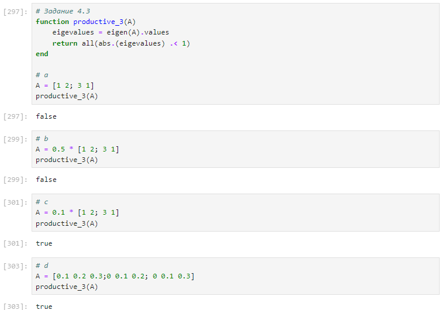{ #fig:033 width=70% }

# Вывод

Изучила возможности специализированных пакетов Julia для выполнения и оценки эффективности операций над объектами линейной алгебры.
