---
## Front matter
lang: ru-RU
title: Лабораторная работа №5
subtitle: "Построение графиков"
author:
  - Легиньких Г.А.
institute:
  - Российский университет дружбы народов, Москва, Россия

## i18n babel
babel-lang: russian
babel-otherlangs: english

## Formatting pdf
toc: false
toc-title: Содержание
slide_level: 2
aspectratio: 169
section-titles: true
theme: metropolis
header-includes:
 - \metroset{progressbar=frametitle,sectionpage=progressbar,numbering=fraction}
 - '\makeatletter'
 - '\beamer@ignorenonframefalse'
 - '\makeatother'
---

# Информация

## Докладчик

:::::::::::::: {.columns align=center}
::: {.column width="70%"}

  * Легиньких Галина Андреевна
  * НФИбд-02-21
  * Российский университет дружбы народов
  * [1032216447@pfur.ru](mailto:1032216447@pfur.ru)
  * <https://github.com/galeginkikh>

:::
::: {.column width="30%"}

:::
::::::::::::::

# Основная информация

## Цель работы

Основная цель работы — освоить синтаксис языка Julia для построения графиков.

## Задание

1. Используя Jupyter Lab, повторите примеры из раздела 5.2. При этом дополните графики обозначениями осей координат, легендой с названиями траекторий, названиями графиков и т.п.
2. Выполните задания для самостоятельной работы (раздел 5.4).

# Выполнение лабораторной работы

## 

Для начала я повторила примеры и дробавила, где это было необходимо, обозначения осей координат, легенду с названиями траекторий, названия графиков и т.п. Больше я это нигде прописывать не буду.

Julia поддерживает несколько пакетов для работы с графиками. Использование того или иного пакета зависит от целей, преследуемых пользователем при построении. Стандартным для Julia является пакет Plots.jl.

## Основные пакеты для работы с графиками в Julia

Основные пакеты для работы с графиками в Julia

{ #fig:001 width=50% }

## Опции при построении графика

Опции при построении графика

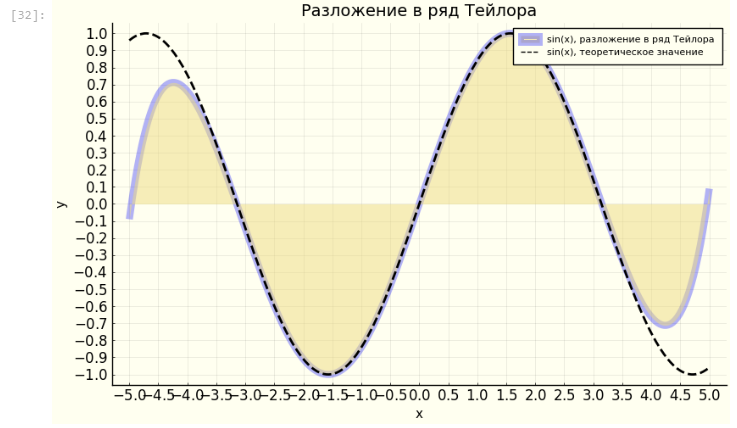{ #fig:005 width=50% }

## Точечный график

Точечный график

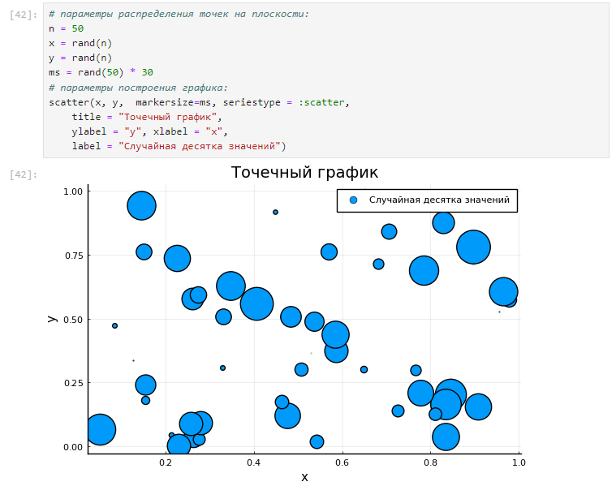{ #fig:006 width=50% }

## Точечный график

{ #fig:007 width=50% }

## Аппроксимация данных

Аппроксимация — научный метод, состоящий в замене объектов их более простыми аналогами, сходными по своим свойствам.

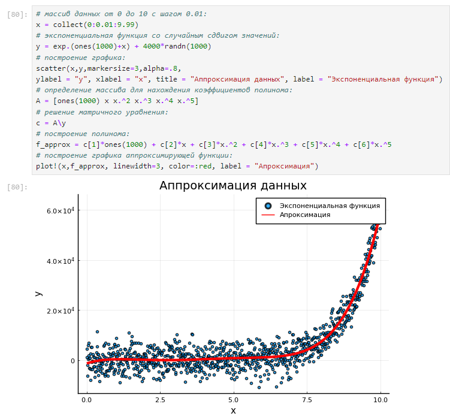{ #fig:008 width=50% }

## Две оси ординат

Иногда требуется на один график вывести несколько траекторий с существенными отличиями в значениях по оси ординат.

{ #fig:009 width=50% }

## Полярные координаты

Полярные координаты

{ #fig:010 width=50% }

## Параметрический график

Параметрический график кривой на плоскости

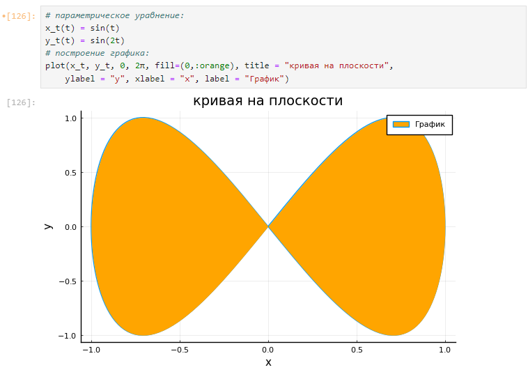{ #fig:011 width=50% }

## Параметрический график

Параметрический график кривой в пространстве

{ #fig:012 width=50% }

## График поверхности

График поверхности (использована функция surface())

{ #fig:013 width=50% }

## График поверхности

График поверхности (использована функция plot())

{ #fig:014 width=50% }

## График поверхности

Сглаженный график поверхности

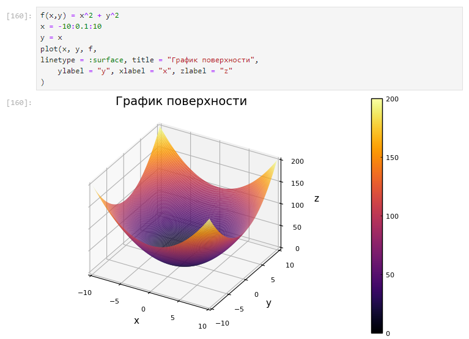{ #fig:015 width=50% }

## График поверхности

График поверхности с изменённым углом зрения

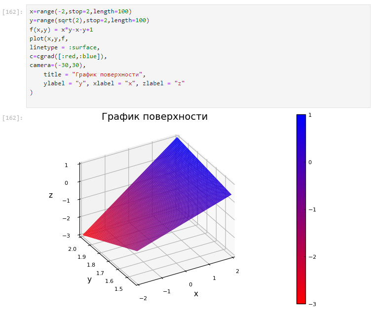{ #fig:016 width=50% }

## Линии уровня

{ #fig:017 width=50% }

## Линии уровня

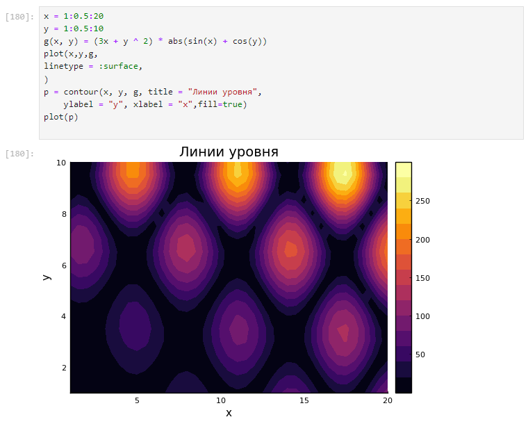{ #fig:018 width=50% }

## Векторные поля

{ #fig:019 width=50% }

## Векторные поля

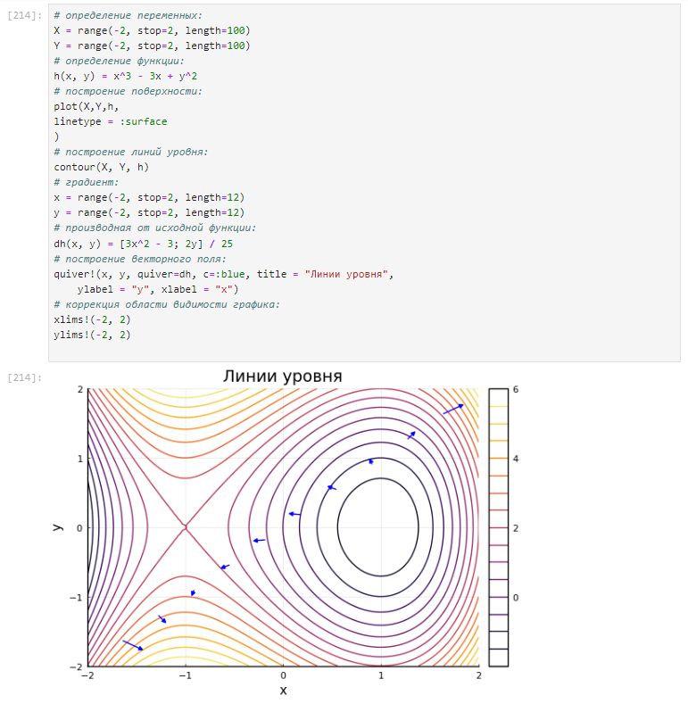{ #fig:020 width=50% }

## Gif-анимация

{ #fig:022 width=40% }

## Гипоциклоида

Гипоциклоида — плоская кривая, образуемая точкой окружности, катящейся по внутренней стороне другой окружности без скольжения. 

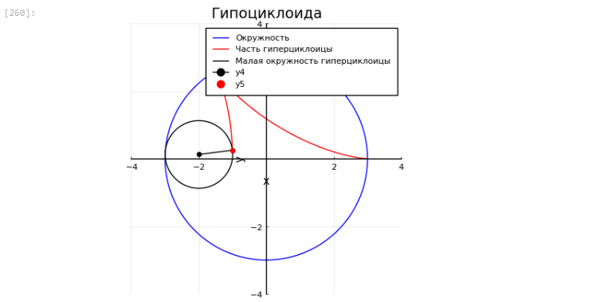{ #fig:024 width=50% }

## Гипоциклоида

В конце сделаем анимацию получившегося изображения. 

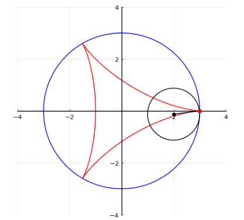{ #fig:025 width=50% }

## Errorbars

В исследованиях часто требуется изобразить графики погрешностей измерения. Подключила пакет Statistics. 

{ #fig:026 width=50% }

##  Использование пакета Distributions

Использование пакета Distributions. 

{ #fig:031 width=50% }

## Подграфики

Определим макет расположения графиков. Команда layout принимает кортеж layout = (N, M), который строит сетку графиков NxM. Например, если задать layout = (4,1) на графике четыре серии, то получим четыре ряда графиков.

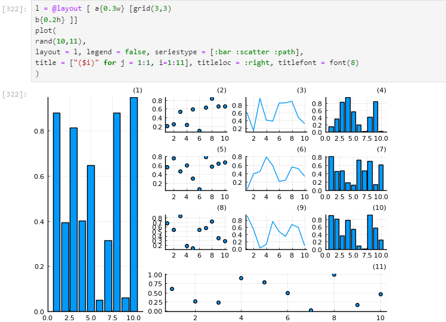{ #fig:038 width=50% }

## Задания для самостоятельного выполнения

- Задание 1

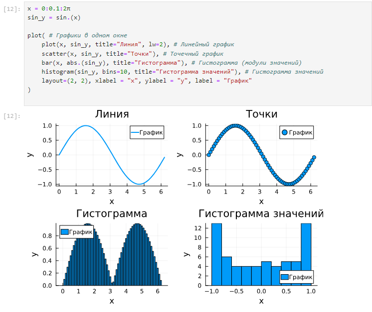{ #fig:039 width=50% }

## Задания для самостоятельного выполнения

- Задание 2

{ #fig:040 width=50% }

## Задания для самостоятельного выполнения

- Задание 3

{ #fig:041 width=50% }

## Задания для самостоятельного выполнения

- Задание 4

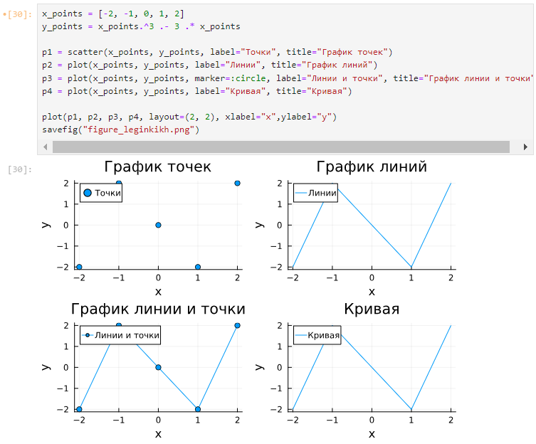{ #fig:042 width=50% }

## Задания для самостоятельного выполнения

- Задание 5

{ #fig:043 width=50% }

## Задания для самостоятельного выполнения

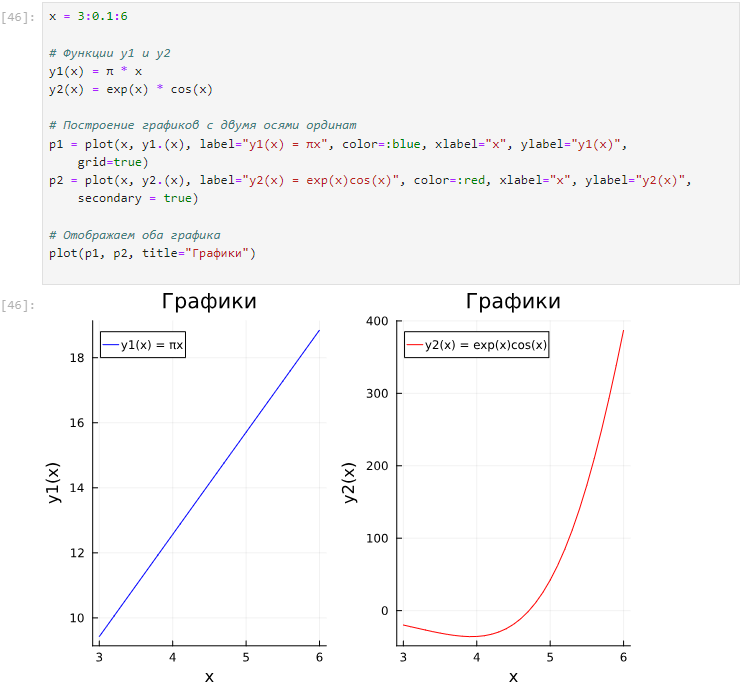{ #fig:044 width=50% }

## Задания для самостоятельного выполнения

- Задание 6

{ #fig:045 width=50% }

## Задания для самостоятельного выполнения

- Задание 7

{ #fig:046 width=50% }

## Задания для самостоятельного выполнения

- Задание 8

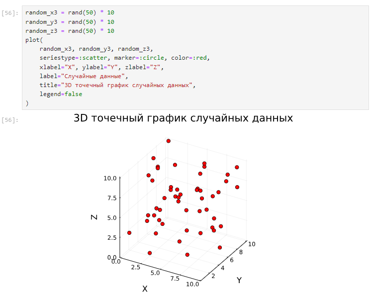{ #fig:047 width=50% }

## Задания для самостоятельного выполнения

- Задание 9

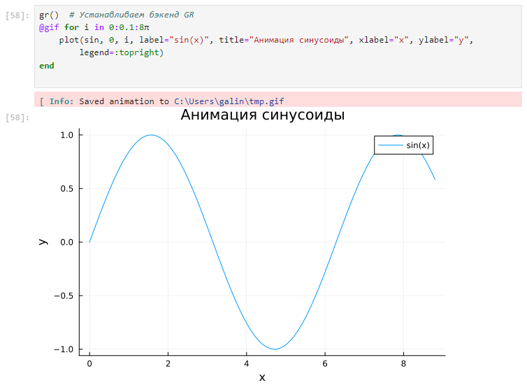{ #fig:048 width=50% }

## Задания для самостоятельного выполнения

- Задание 10

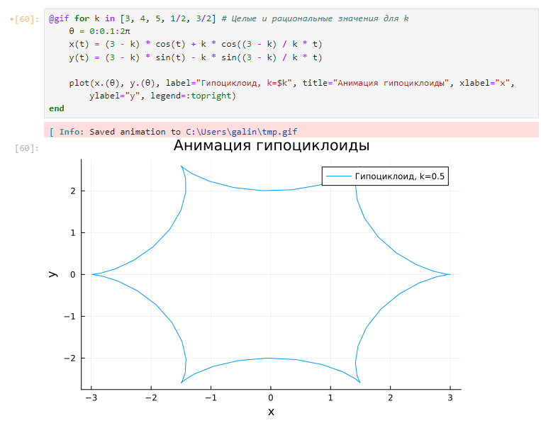{ #fig:049 width=50% }

## Задания для самостоятельного выполнения

- Задание 11

{ #fig:050 width=50% }

# Вывод

Освоила синтаксис языка Julia для построения графиков.