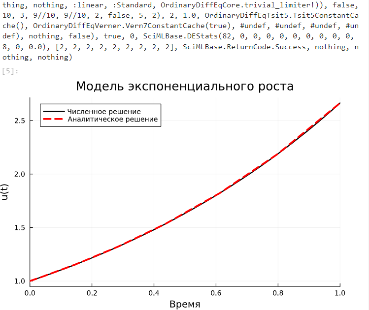
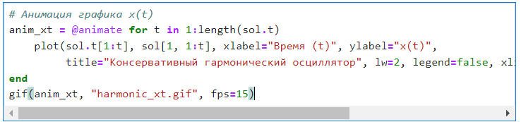
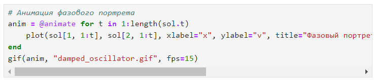

---
## Front matter
title: "Отчет по лабораторной работе №6"
subtitle: "Решение моделей в непрерывном и дискретном времени"
author: "Легиньких Галина Андреевна"

## Generic otions
lang: ru-RU
toc-title: "Содержание"
## Pdf output format
toc: true # Table of contents
toc-depth: 2
lof: true # List of figures
lot: true # List of tables
fontsize: 12pt
linestretch: 1.5
papersize: a4
documentclass: scrreprt
## I18n polyglossia
polyglossia-lang:
  name: russian
  options:
  - spelling=modern
  - babelshorthands=true
polyglossia-otherlangs:
  name: english
## I18n babel
babel-lang: russian
babel-otherlangs: english
## Fonts
mainfont: PT Serif
romanfont: PT Serif
sansfont: PT Sans
monofont: PT Mono
mainfontoptions: Ligatures=TeX
romanfontoptions: Ligatures=TeX
sansfontoptions: Ligatures=TeX,Scale=MatchLowercase
monofontoptions: Scale=MatchLowercase,Scale=0.9
## Biblatex
biblatex: true
biblio-style: "gost-numeric"
biblatexoptions:
  - parentracker=true
  - backend=biber
  - hyperref=auto
  - language=auto
  - autolang=other*
  - citestyle=gost-numeric
## Pandoc-crossref LaTeX customization
figureTitle: "Рис."
tableTitle: "Таблица"
listingTitle: "Листинг"
lofTitle: "Список иллюстраций"
lotTitle: "Список таблиц"
lolTitle: "Листинги"
## Misc options
indent: true
header-includes:
  - \usepackage{indentfirst}
  - \usepackage{float} # keep figures where there are in the text
  - \floatplacement{figure}{H} # keep figures where there are in the text
---

# Цель работы

Основной целью работы является освоение специализированных пакетов для решения задач в непрерывном и дискретном времени.

# Задание

1. Используя Jupyter Lab, повторите примеры из раздела 6.2.
2. Выполните задания для самостоятельной работы (раздел 6.4).

# Выполнение лабораторной работы

**1.** Для начала я повторила все примеры. Тут их не так много. Первый пример это модель экспоненциального роста. Для решения обыкновенных дифференциальных уравнений (ОДУ) в Julia можно использовать пакет diffrentialEquations.jl. Численное решение в Julia будет иметь следующий вид:
(рис. [-@fig:001]) 

{ #fig:001 width=70% }

Далее получила графика, соответствующий полученному решению:
(рис. [-@fig:002]) 

{ #fig:002 width=70% }

Если требуется задать точность решения, то можно воспользоваться параметрами
abstol (задаёт близость к нулю) и reltol (задаёт относительную точность). (рис. [-@fig:003]) 

{ #fig:003 width=70% }

**2.** Далее рассмотрела систему Лоренца. Численное решение в Julia будет иметь следующий вид:
(рис. [-@fig:004]) (рис. [-@fig:005]) (рис. [-@fig:006])  

{ #fig:004 width=70% }
{ #fig:005 width=70% }
{ #fig:006 width=70% }

Можно отключить интерполяцию. (рис. [-@fig:007]) 

{ #fig:007 width=70% }

**3.** Рассмотрела Модель Лотки–Вольтерры. Модель Лотки–Вольтерры описывает взаимодействие двух видов типа «хищник – жертва», где x - количество жертв, y — количество хищников, t — время, alfa, beta, gamma, delta — коэффициенты, отражающие взаимодействия между видами (в данном случае alfa — коэффициент рождаемости жертв, gamma — коэффициент убыли хищников, beta — коэффициент убыли жертв в результате взаимодействия с хищниками, delta — коэффициент роста численности хищников). Численное решение в Julia будет иметь следующий вид:
(рис. [-@fig:008]) (рис. [-@fig:009]) 

{ #fig:008 width=70% }

{ #fig:009 width=70% }

**10.** Приступила к заданиям для самостоятельной работы. Нумерация соответствует.

- Задание 1 (рис. [-@fig:010]) (рис. [-@fig:011]) (рис. [-@fig:012]) (рис. [-@fig:013]) 

{ #fig:010 width=70% }

{ #fig:011 width=70% }

{ #fig:012 width=70% }

{ #fig:013 width=70% }

- Задание 2 (рис. [-@fig:014]) (рис. [-@fig:015]) (рис. [-@fig:016]) (рис. [-@fig:017]) 

{ #fig:014 width=70% }

{ #fig:015 width=70% }

{ #fig:016 width=70% }

{ #fig:017 width=70% }

- Задание 3 (рис. [-@fig:018]) (рис. [-@fig:019]) (рис. [-@fig:020]) (рис. [-@fig:021]) 

{ #fig:018 width=70% }

{ #fig:019 width=70% }

{ #fig:020 width=70% }

{ #fig:021 width=70% }

- Задание 4 (рис. [-@fig:022]) (рис. [-@fig:023]) (рис. [-@fig:024]) (рис. [-@fig:025]) 

{ #fig:022 width=70% }

{ #fig:023 width=70% }

{ #fig:024 width=70% }

{ #fig:025 width=70% }

- Задание 5 (рис. [-@fig:026]) (рис. [-@fig:027]) (рис. [-@fig:028])

{ #fig:026 width=70% }

{ #fig:027 width=70% }

{ #fig:028 width=70% }

- Задание 6 (рис. [-@fig:029]) (рис. [-@fig:030]) (рис. [-@fig:031]) (рис. [-@fig:032]) 

{ #fig:029 width=70% }

{ #fig:030 width=70% }

{ #fig:031 width=70% }

{ #fig:032 width=70% }

- Задание 7 (рис. [-@fig:033]) (рис. [-@fig:034]) (рис. [-@fig:035]) (рис. [-@fig:036]) (рис. [-@fig:037]) (рис. [-@fig:038]) (рис. [-@fig:039])

{ #fig:033 width=70% }

{ #fig:034 width=70% }

{ #fig:035 width=70% }

{ #fig:036 width=70% }

{ #fig:037 width=70% }

{ #fig:038 width=70% }

{ #fig:039 width=70% }

- Задание 8 (рис. [-@fig:040]) (рис. [-@fig:041]) (рис. [-@fig:042]) (рис. [-@fig:043]) (рис. [-@fig:044]) (рис. [-@fig:045]) (рис. [-@fig:046])

{ #fig:040 width=70% }

{ #fig:0341 width=70% }

{ #fig:042 width=70% }

{ #fig:043 width=70% }

{ #fig:044 width=70% }

{ #fig:045 width=70% }

{ #fig:046 width=70% }

# Вывод

Освоила специализированные пакеты для решения задач в непрерывном и дискретном времени.