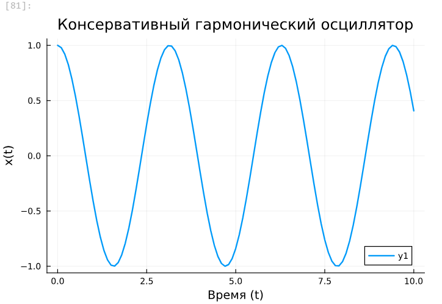

---
## Front matter
lang: ru-RU
title: Лабораторная работа №6
subtitle: "Решение моделей в непрерывном и дискретном времени"
author:
  - Легиньких Г.А.
institute:
  - Российский университет дружбы народов, Москва, Россия

## i18n babel
babel-lang: russian
babel-otherlangs: english

## Formatting pdf
toc: false
toc-title: Содержание
slide_level: 2
aspectratio: 169
section-titles: true
theme: metropolis
header-includes:
 - \metroset{progressbar=frametitle,sectionpage=progressbar,numbering=fraction}
 - '\makeatletter'
 - '\beamer@ignorenonframefalse'
 - '\makeatother'
---

# Информация

## Докладчик

:::::::::::::: {.columns align=center}
::: {.column width="70%"}

  * Легиньких Галина Андреевна
  * НФИбд-02-21
  * Российский университет дружбы народов
  * [1032216447@pfur.ru](mailto:1032216447@pfur.ru)
  * <https://github.com/galeginkikh>

:::
::: {.column width="30%"}

:::
::::::::::::::

# Основная информация

## Цель работы

Основной целью работы является освоение специализированных пакетов для решения задач в непрерывном и дискретном времени.

## Задание

1. Используя Jupyter Lab, повторите примеры из раздела 6.2.
2. Выполните задания для самостоятельной работы (раздел 6.4).

# Выполнение лабораторной работы

## Модель экспоненциального роста

**1.** Для решения обыкновенных дифференциальных уравнений (ОДУ) в Julia можно использовать пакет diffrentialEquations.jl. 

{ #fig:001 width=50% }

## Модель экспоненциального роста

Далее получила графика, соответствующий полученному решению:

{ #fig:002 width=50% }

## Модель экспоненциального роста

Если требуется задать точность решения, то можно воспользоваться параметрами
abstol (задаёт близость к нулю) и reltol (задаёт относительную точность).

{ #fig:003 width=50% }

## Система Лоренца

**2.** Далее рассмотрела систему Лоренца. Численное решение в Julia будет иметь следующий вид:
 
{ #fig:005 width=50% }

## Система Лоренца

{ #fig:006 width=50% }

## Система Лоренца

Можно отключить интерполяцию.

{ #fig:007 width=50% }

## Модель Лотки–Вольтерры

**3.** Рассмотрела Модель Лотки–Вольтерры. Численное решение в Julia будет иметь следующий вид:

{ #fig:008 width=50% }

## Модель Лотки–Вольтерры

{ #fig:009 width=50% }

## Модель Мальтуса

**10.** Приступила к заданиям для самостоятельной работы. Нумерация соответствует.

- Задание 1 

{ #fig:011 width=50% }

## Модель Мальтуса

{ #fig:013 width=50% }

## Логистическую модель

- Задание 2 

{ #fig:015 width=50% }

## Логистическую модель

{ #fig:017 width=50% }

## SIR-модель

- Задание 3

{ #fig:019 width=50% }

## SIR-модель

{ #fig:021 width=50% }

## SEIR-модель

- Задание 4

{ #fig:023 width=50% }

## SEIR-модель

{ #fig:025 width=50% }

## Модели Лотки–Вольтерры

- Задание 5

{ #fig:027 width=50% }

## Модели Лотки–Вольтерры

{ #fig:028 width=50% }

## Модель отбора на основе конкурентных отношений

- Задание 6

{ #fig:030 width=50% }

## Модель отбора на основе конкурентных отношений

{ #fig:032 width=50% }

## Модель консервативного гармонического осциллятора

- Задание 7 

{ #fig:034 width=50% }

## Модель консервативного гармонического осциллятора

{ #fig:035 width=50% }

## Модель консервативного гармонического осциллятора

{ #fig:037 width=50% }

## Модель консервативного гармонического осциллятора

{ #fig:039 width=50% }

## Модель свободных колебаний гармонического осциллятора

- Задание 8 

{ #fig:0341 width=50% }

## Модель свободных колебаний гармонического осциллятора

{ #fig:042 width=50% }

## Модель свободных колебаний гармонического осциллятора

{ #fig:044 width=50% }

## Модель свободных колебаний гармонического осциллятора

{ #fig:046 width=50% }

# Вывод

Освоила специализированные пакеты для решения задач в непрерывном и дискретном времени.