---
## Front matter
title: "Отчет по лабораторной работе №7"
subtitle: "Введение в работу с данными"
author: "Легиньких Галина Андреевна"

## Generic otions
lang: ru-RU
toc-title: "Содержание"
## Pdf output format
toc: true # Table of contents
toc-depth: 2
lof: true # List of figures
lot: true # List of tables
fontsize: 12pt
linestretch: 1.5
papersize: a4
documentclass: scrreprt
## I18n polyglossia
polyglossia-lang:
  name: russian
  options:
  - spelling=modern
  - babelshorthands=true
polyglossia-otherlangs:
  name: english
## I18n babel
babel-lang: russian
babel-otherlangs: english
## Fonts
mainfont: PT Serif
romanfont: PT Serif
sansfont: PT Sans
monofont: PT Mono
mainfontoptions: Ligatures=TeX
romanfontoptions: Ligatures=TeX
sansfontoptions: Ligatures=TeX,Scale=MatchLowercase
monofontoptions: Scale=MatchLowercase,Scale=0.9
## Biblatex
biblatex: true
biblio-style: "gost-numeric"
biblatexoptions:
  - parentracker=true
  - backend=biber
  - hyperref=auto
  - language=auto
  - autolang=other*
  - citestyle=gost-numeric
## Pandoc-crossref LaTeX customization
figureTitle: "Рис."
tableTitle: "Таблица"
listingTitle: "Листинг"
lofTitle: "Список иллюстраций"
lotTitle: "Список таблиц"
lolTitle: "Листинги"
## Misc options
indent: true
header-includes:
  - \usepackage{indentfirst}
  - \usepackage{float} # keep figures where there are in the text
  - \floatplacement{figure}{H} # keep figures where there are in the text
---

# Цель работы

Основной целью работы является специализированных пакетов Julia для обработки данных.

# Задание

1. Используя Jupyter Lab, повторите примеры из раздела 7.2.
2. Выполните задания для самостоятельной работы (раздел 7.4).

# Выполнение лабораторной работы

**1.** Для начала я повторила примеры по данной теме. Начала с раздела считывание данных.
В Julia для работы с такого рода структурами данных используют пакеты CSV, DataFrames, RDatasets, FileIO. Скачала эти пакеты и попробовала прочитать данные из скаченного датафрейма.
(рис. [-@fig:001]) 

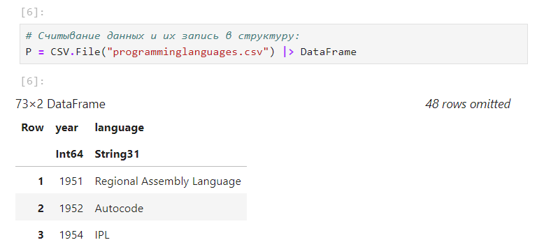{ #fig:001 width=70% }

Далее приведём пример функции, в которой на входе указывается название языка программирования, а на выходе — год его создания.
(рис. [-@fig:002]) 

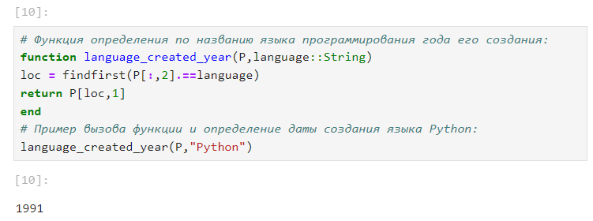{ #fig:002 width=70% }

При этом, чтобы убрать в функции зависимость данных от регистра, необходимо изменить исходную функцию следующим образом.
(рис. [-@fig:003]) 

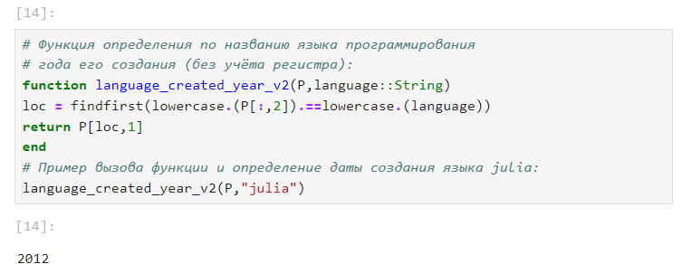{ #fig:003 width=70% }

**2.** Далее попробовала записать данные в файл, а так же задала при сохранении тип файла и разделитель.

**3.** При работе с данными бывает удобно записать их в формате словаря.При инициализации словаря можно задать конкретные типы данных для ключей и значений,а можно инициировать пустой словарь, не задавая строго структуру.
(рис. [-@fig:004]) 

{ #fig:004 width=70% }

В результате при вызове словаря можно, выбрав любой год, узнать, какие языки программирования были созданы в этом году.
(рис. [-@fig:005]) 

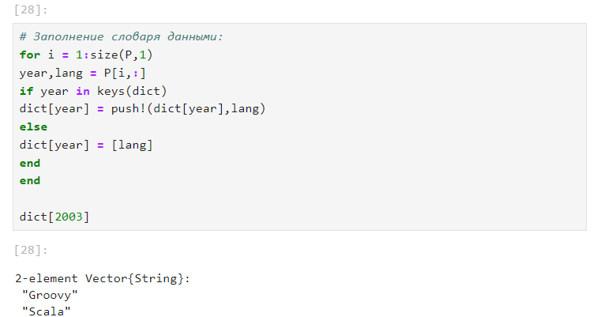{ #fig:005 width=70% }

**4.** На примере с данными о языках программирования и годах их создания зададим структуру DataFrame. Попробовала вывести один столбец. 
(рис. [-@fig:006]) 

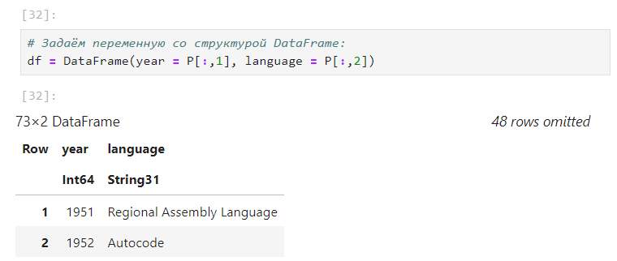{ #fig:006 width=70% }

А так же получила статистические сведения о фрейме.
(рис. [-@fig:007]) 

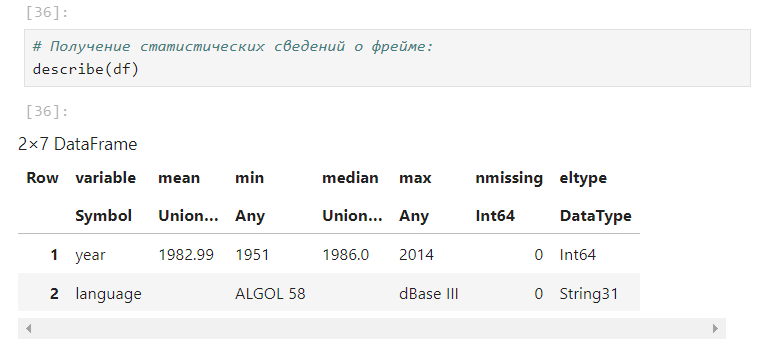{ #fig:007 width=70% }

**5.** С данными можно работать также как с наборами данных через пакет RDatasets языка R.

**6.** Попробовала порабоать с переменными отсутствующего типа. (рис. [-@fig:008]) 

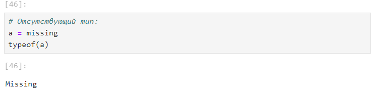{ #fig:008 width=70% }

**7.** Перешла к обработке данных. И первый метод это метод k-средних.
Задача кластеризации данных заключается в формировании однородной группы упорядоченных по какому-то признаку данных.
Метод k-средних позволяет минимизировать суммарное квадратичное отклонение точек кластеров от центров этих кластеров. Рассмотрела задачу кластеризации данных на примере данных о недвижимости. (рис. [-@fig:009]) (рис. [-@fig:010]) (рис. [-@fig:011])

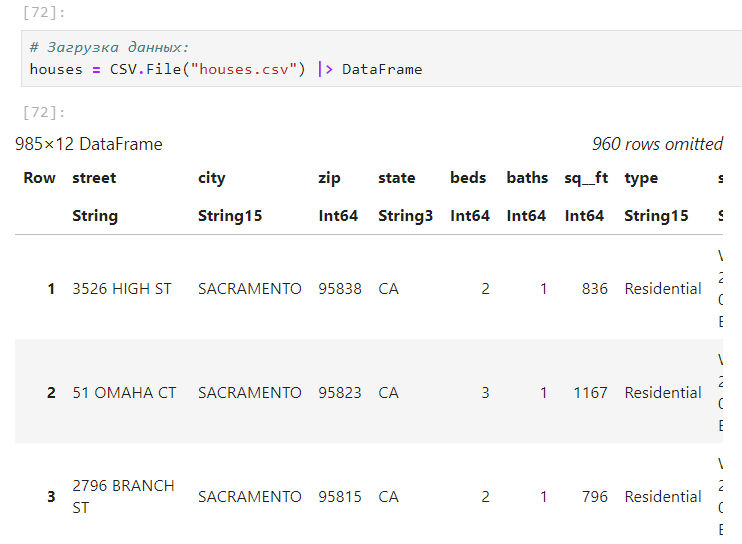{ #fig:009 width=70% }

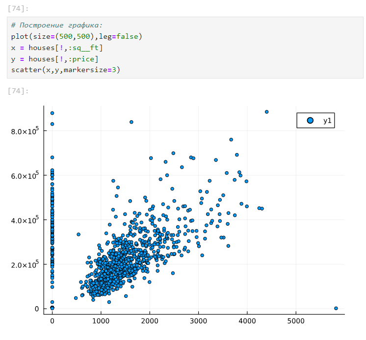{ #fig:010 width=70% }

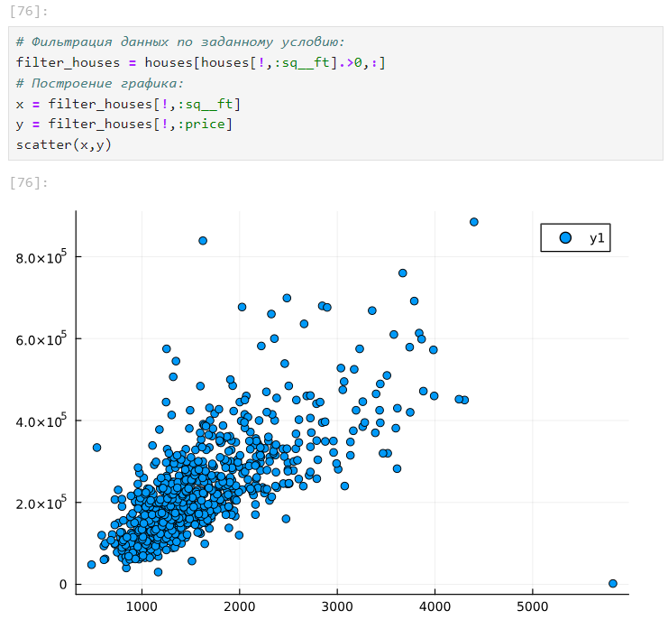{ #fig:011 width=70% }

Сначала подключаем необходимые пакеты и формируем данные в нужном виде: (рис. [-@fig:012]) (рис. [-@fig:013])

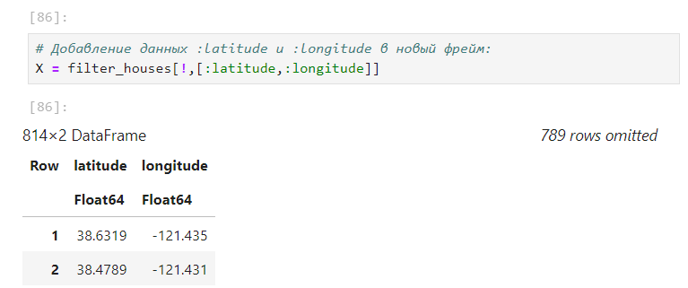{ #fig:012 width=70% }

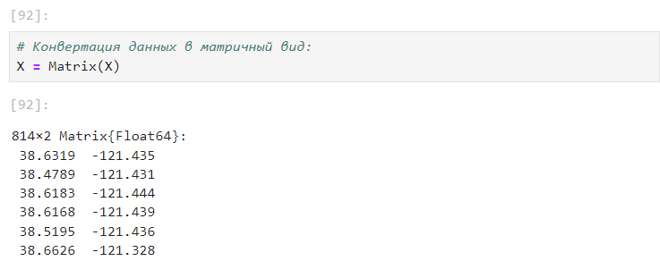{ #fig:013 width=70% }

В качестве критерия для формирования кластеров данных и определения количества кластеров попробуем использовать количество почтовых индексов: (рис. [-@fig:014])

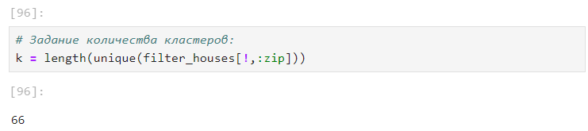{ #fig:014 width=70% }

Далее сформируем новый фрейм, включающий исходные данные о недвижимости и столбец с данными о назначенном каждому дому кластере (рис. [-@fig:015])

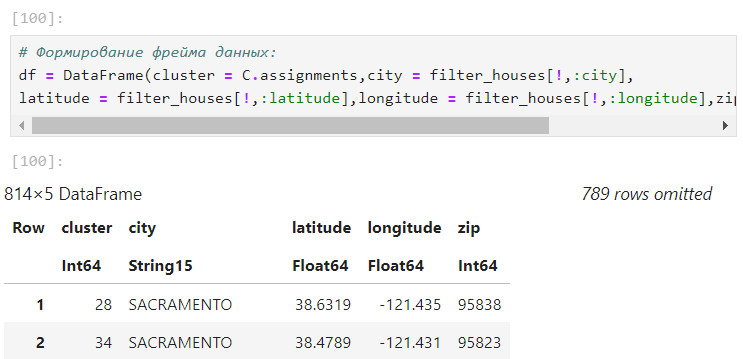{ #fig:015 width=70% }

Плстроила график, обозначив каждый кластер отдельным цветом (рис. [-@fig:016])

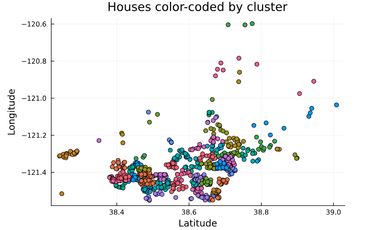{ #fig:016 width=70% }

Построила график, раскрасив кластеры по почтовому индексу (рис. [-@fig:017])

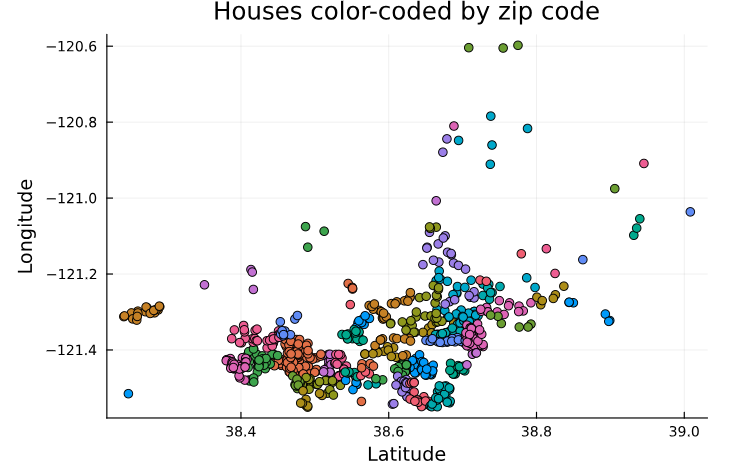{ #fig:017 width=70% }

**8.** Кластеризация данных. Метод k ближайших соседей.
Данный метод заключается в отнесении объекта к тому из известных классов, который является наиболее распространённым среди 𝑘 соседей данного элемента. В случае использования метода для регрессии, объекту присваивается среднее значение по 𝑘 ближайшим к нему объектам. (рис. [-@fig:018]) (рис. [-@fig:019])

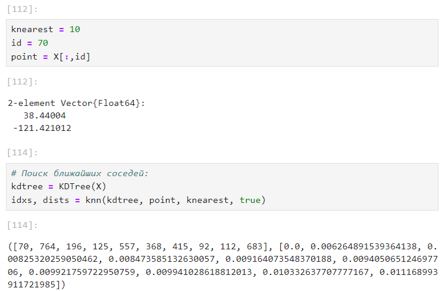{ #fig:018 width=70% }

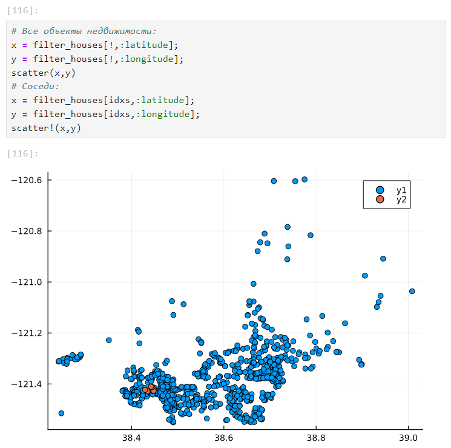{ #fig:019 width=70% }

**9.** Обработка данных. Метод главных компонент.
Метод главных компонент (Principal Components Analysis, PCA) позволяет уменьшить размерность данных, потеряв наименьшее количество полезной информации. Метод имеет широкое применение в различных областях знаний, например, при визуализации данных, компрессии изображений, в эконометрике, некоторых гуманитарных предметных областях, например, в социологии или в политологии.

На примере с данными о недвижимости попробуем уменьшить размеры данных о цене и площади из набора данных домов (рис. [-@fig:020]) (рис. [-@fig:021]) (рис. [-@fig:022])

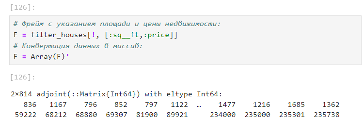{ #fig:020 width=70% }

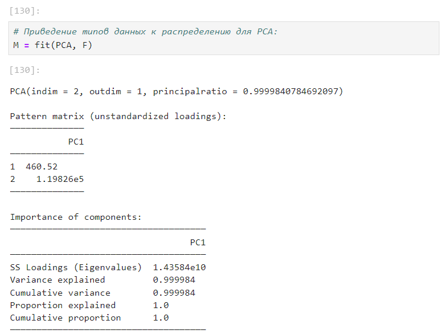{ #fig:021 width=70% }

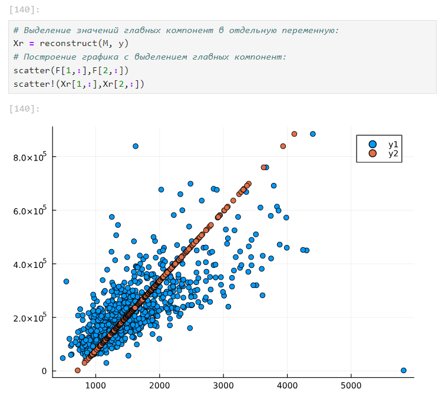{ #fig:022 width=70% }

**10.** Обработка данных. Линейная регрессия.
Регрессионный анализ представляет собой набор статистических методов исследования влияния одной или нескольких независимых переменных (регрессоров) на зависимую (критериальная) переменную. Терминология зависимых и независимых переменных отражает лишь математическую зависимость переменных, а не причинноследственные отношения.

Зададим случайный набор данных (можно использовать и полученные экспериментальным путём какие-то данные). Попробуем найти для данных лучшее соответствие
(рис. [-@fig:023])

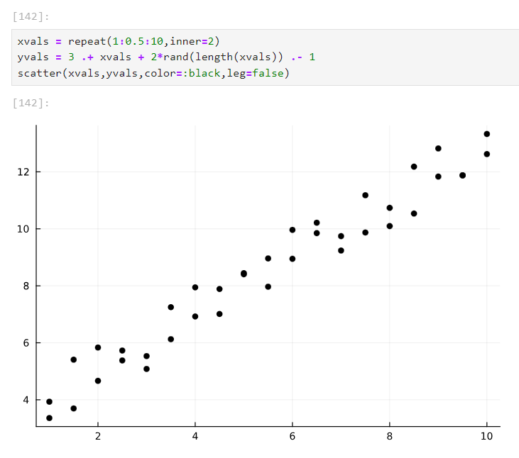{ #fig:023 width=70% }

Применим функцию линейной регрессии для построения соответствующего графика
значений (рис. [-@fig:024])

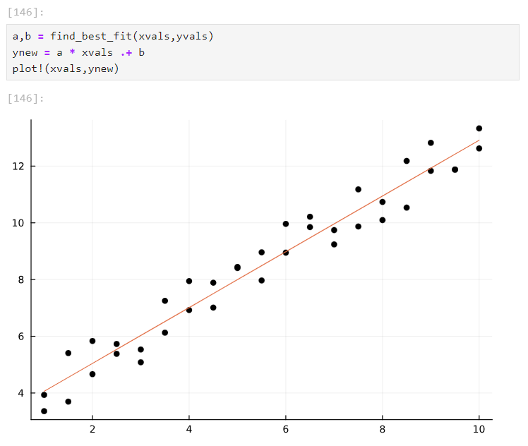{ #fig:024 width=70% }

**11.** Перешла к заданиям для самостоятельного выполнения. Нумерация соотвествует.

- Задание на Кластеризацию. (рис. [-@fig:025]) (рис. [-@fig:026])

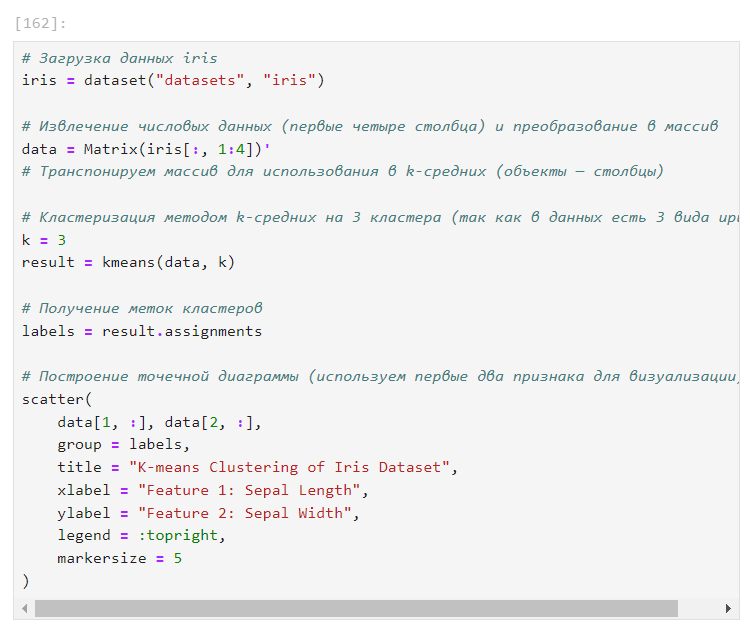{ #fig:025 width=70% }

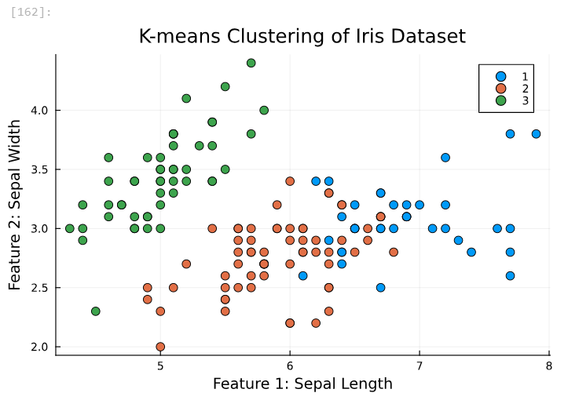{ #fig:026 width=70% }

- Задание на регрессию (часть 1) (рис. [-@fig:027]) (рис. [-@fig:028])

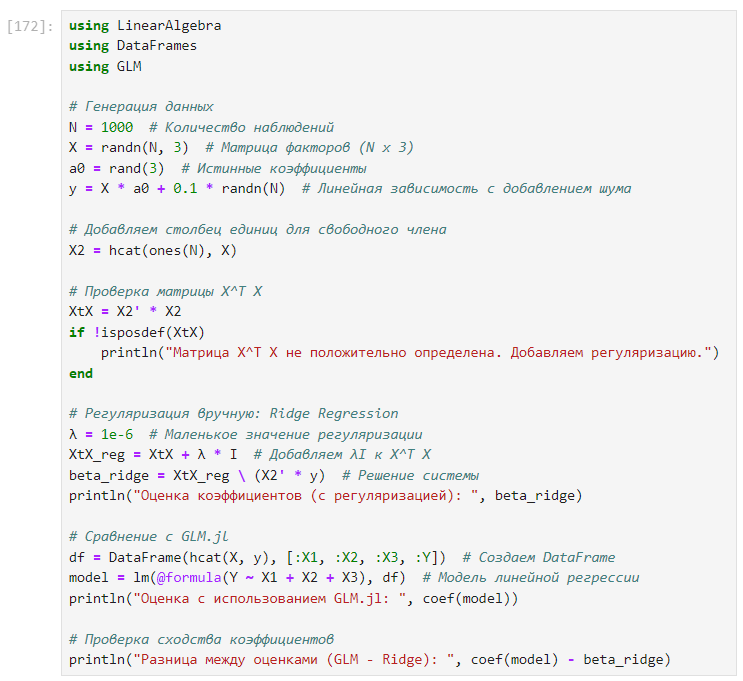{ #fig:027 width=70% }

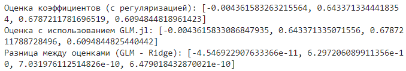{ #fig:028 width=70% }

- Задание на регрессию (часть 2) (рис. [-@fig:029]) (рис. [-@fig:030])

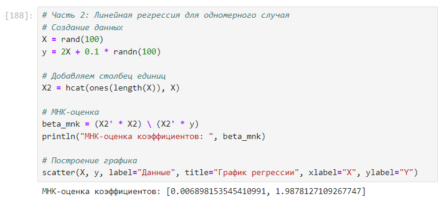{ #fig:029 width=70% }

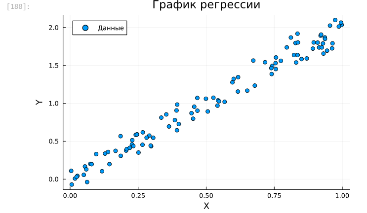{ #fig:030 width=70% }

- Модель ценообразования биномиальных опционов (a) (рис. [-@fig:031]) (рис. [-@fig:032])

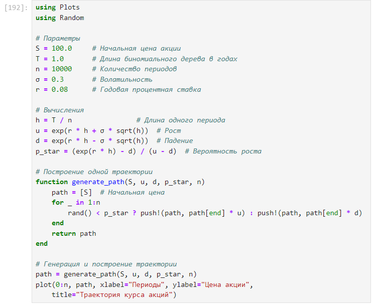{ #fig:031 width=70% }

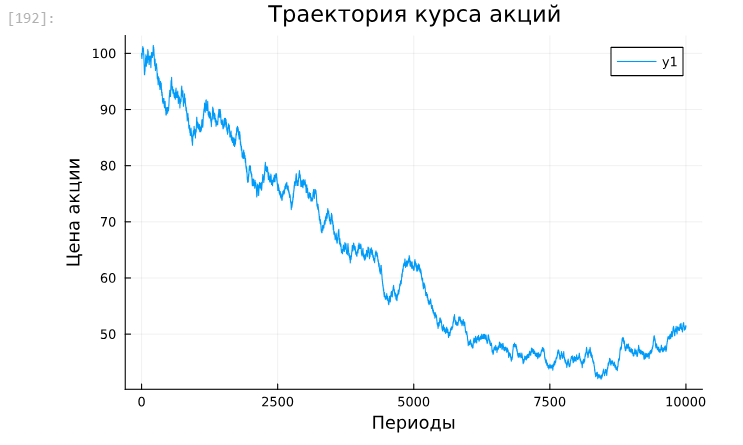{ #fig:032 width=70% }

- Модель ценообразования биномиальных опционов (b) (рис. [-@fig:033])

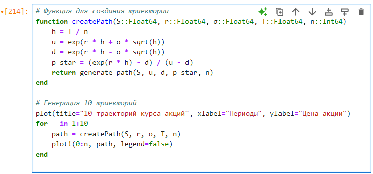{ #fig:033 width=70% }

- Модель ценообразования биномиальных опционов (c) (рис. [-@fig:034]) (рис. [-@fig:035])

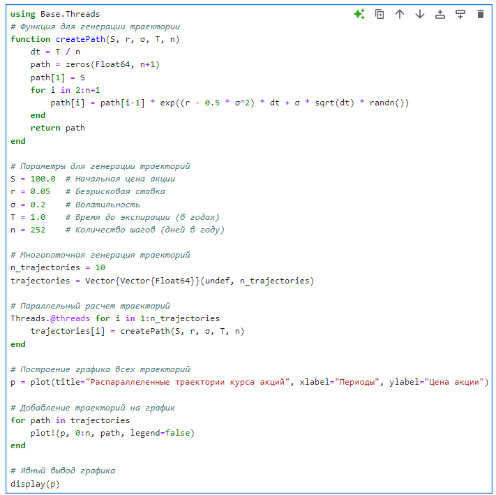{ #fig:034 width=70% }

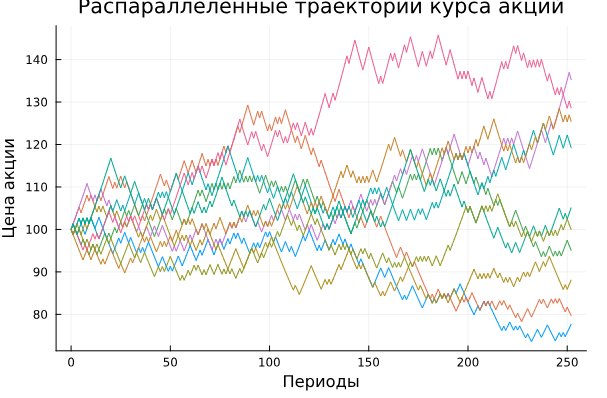{ #fig:035 width=70% }

- Модель ценообразования биномиальных опционов (d) (рис. [-@fig:036])

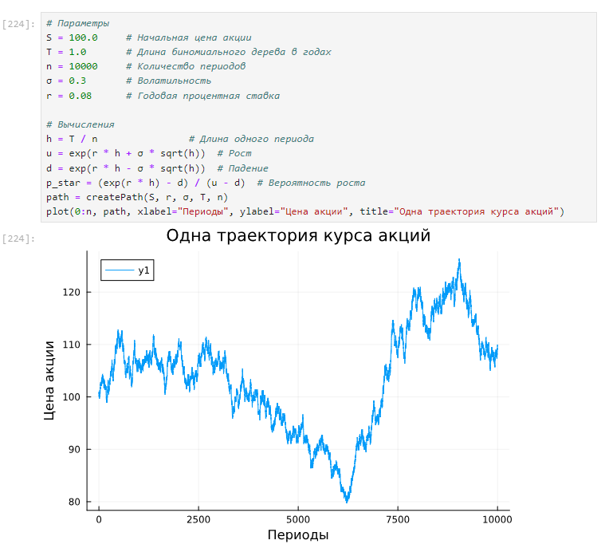{ #fig:036 width=70% }

# Вывод

Изучила специализированные пакеты Julia для обработки данных.