---
## Front matter
title: "Отчет по лабораторной работе №8"
subtitle: "Оптимизация"
author: "Легиньких Галина Андреевна"

## Generic otions
lang: ru-RU
toc-title: "Содержание"
## Pdf output format
toc: true # Table of contents
toc-depth: 2
lof: true # List of figures
lot: true # List of tables
fontsize: 12pt
linestretch: 1.5
papersize: a4
documentclass: scrreprt
## I18n polyglossia
polyglossia-lang:
  name: russian
  options:
  - spelling=modern
  - babelshorthands=true
polyglossia-otherlangs:
  name: english
## I18n babel
babel-lang: russian
babel-otherlangs: english
## Fonts
mainfont: PT Serif
romanfont: PT Serif
sansfont: PT Sans
monofont: PT Mono
mainfontoptions: Ligatures=TeX
romanfontoptions: Ligatures=TeX
sansfontoptions: Ligatures=TeX,Scale=MatchLowercase
monofontoptions: Scale=MatchLowercase,Scale=0.9
## Biblatex
biblatex: true
biblio-style: "gost-numeric"
biblatexoptions:
  - parentracker=true
  - backend=biber
  - hyperref=auto
  - language=auto
  - autolang=other*
  - citestyle=gost-numeric
## Pandoc-crossref LaTeX customization
figureTitle: "Рис."
tableTitle: "Таблица"
listingTitle: "Листинг"
lofTitle: "Список иллюстраций"
lotTitle: "Список таблиц"
lolTitle: "Листинги"
## Misc options
indent: true
header-includes:
  - \usepackage{indentfirst}
  - \usepackage{float} # keep figures where there are in the text
  - \floatplacement{figure}{H} # keep figures where there are in the text
---

# Цель работы

Основная цель работа — освоить пакеты Julia для решения задач оптимизации.

# Задание

1. Используя Jupyter Lab, повторите примеры из раздела 8.2.
2. Выполните задания для самостоятельной работы (раздел 8.4).

# Выполнение лабораторной работы

**1.** Повторила пример линейного программирования. Линейное программирование рассматривает решения экстремальных задач на множествах 𝑛-мерного векторного пространства, задаваемых системами линейных уравнений
и неравенств.

(рис. [-@fig:001]) (рис. [-@fig:002]) 

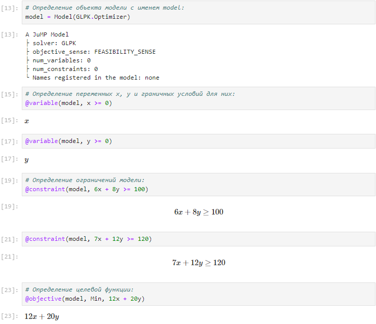{ #fig:001 width=70% }

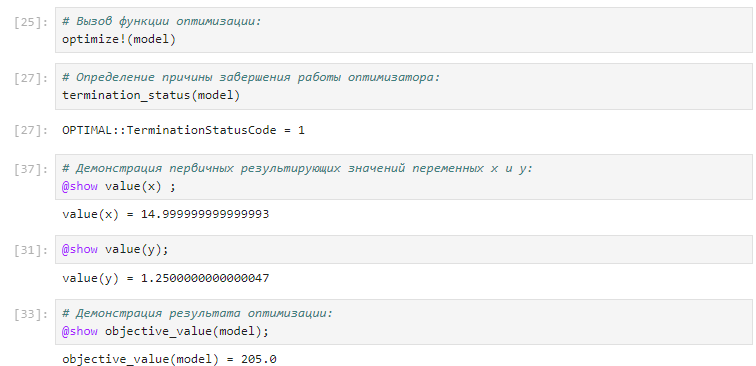{ #fig:002 width=70% }

**2.** Далее пререшла к примеру "Векторизованные ограничения и целевая функция оптимизации". Можно добавить ограничения и цель в JuMP, используя векторизованную линейную алгебру.
(рис. [-@fig:003]) (рис. [-@fig:004]) 

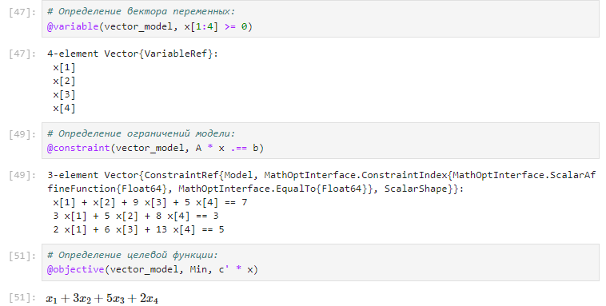{ #fig:003 width=70% }

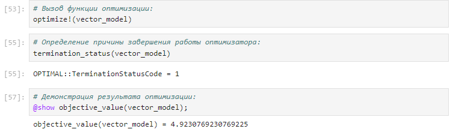{ #fig:004 width=70% }

**3.** Рассмотрела пример "Оптимизация рациона питания". (рис. [-@fig:005]) 

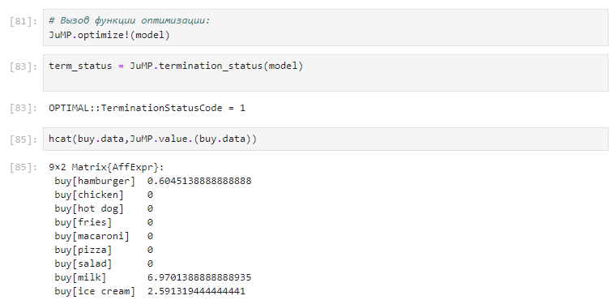{ #fig:005 width=70% }

**4.** Попробовала пример с графиком "Портфельные инвестиции".

(рис. [-@fig:006]) (рис. [-@fig:007]) 

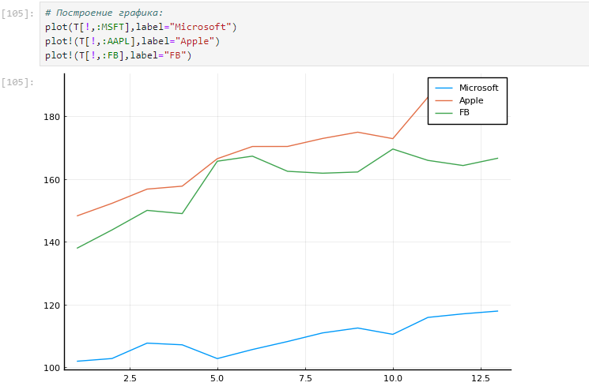{ #fig:006 width=70% }

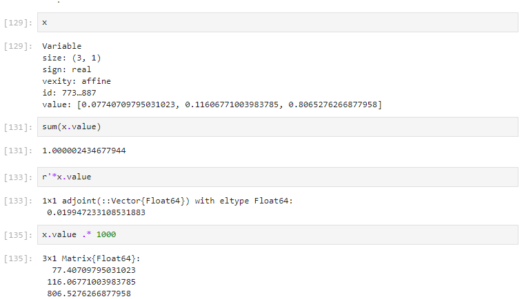{ #fig:007 width=70% }

**5.** И в конце повторила пример по востановлению ихображения. Предположим есть изображение, на котором были изменены некоторые пиксели. Требуется восстановить неизвестные пиксели путём решения задачи оптимизации.

**6.** Перешла к заданиям для самостоятельной работы.

- Задание 1 (рис. [-@fig:008]) 

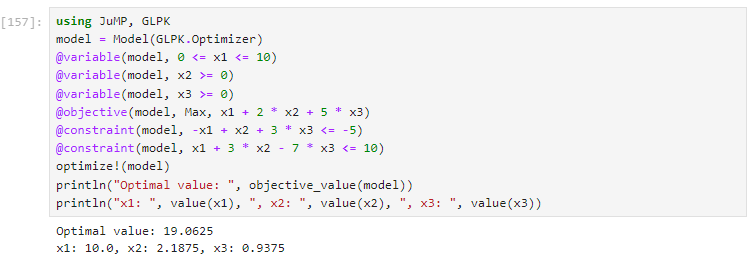{ #fig:008 width=70% }
 
- Задание 2 (рис. [-@fig:009]) 

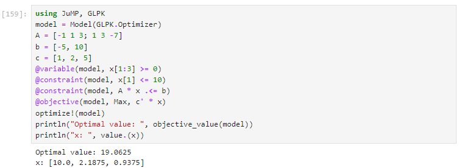{ #fig:009 width=70% }

- Задание 3 (рис. [-@fig:010]) 

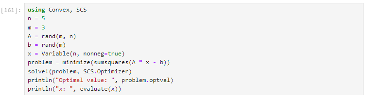{ #fig:010 width=70% }

- Задание 4 (рис. [-@fig:011]) 

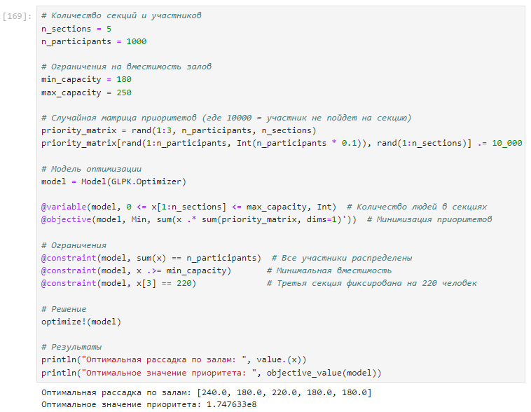{ #fig:011 width=70% }

- Задание 5 (рис. [-@fig:012]) 

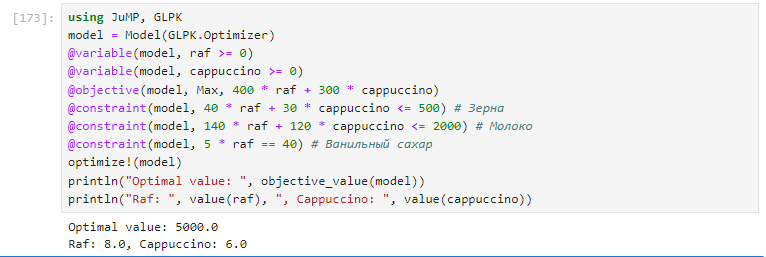{ #fig:012 width=70% }

# Вывод

Освоила пакеты Julia для решения задач оптимизации.