---
## Front matter
lang: ru-RU
title: Лабораторная работа №8
subtitle: "Оптимизация"
author:
  - Легиньких Г.А.
institute:
  - Российский университет дружбы народов, Москва, Россия

## i18n babel
babel-lang: russian
babel-otherlangs: english

## Formatting pdf
toc: false
toc-title: Содержание
slide_level: 2
aspectratio: 169
section-titles: true
theme: metropolis
header-includes:
 - \metroset{progressbar=frametitle,sectionpage=progressbar,numbering=fraction}
 - '\makeatletter'
 - '\beamer@ignorenonframefalse'
 - '\makeatother'
---

# Информация

## Докладчик

:::::::::::::: {.columns align=center}
::: {.column width="70%"}

  * Легиньких Галина Андреевна
  * НФИбд-02-21
  * Российский университет дружбы народов
  * [1032216447@pfur.ru](mailto:1032216447@pfur.ru)
  * <https://github.com/galeginkikh>

:::
::: {.column width="30%"}

:::
::::::::::::::

# Основная информация

## Цель работы

Основная цель работа — освоить пакеты Julia для решения задач оптимизации.

## Задание

1. Используя Jupyter Lab, повторите примеры из раздела 8.2.
2. Выполните задания для самостоятельной работы (раздел 8.4).

# Выполнение лабораторной работы

## 

**1.** Повторила пример линейного программирования. Линейное программирование рассматривает решения экстремальных задач на множествах 𝑛-мерного векторного пространства, задаваемых системами линейных уравнений
и неравенств.

##

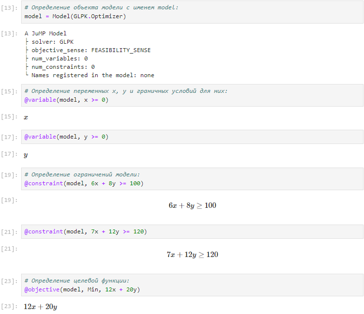{ #fig:001 width=50% }

##

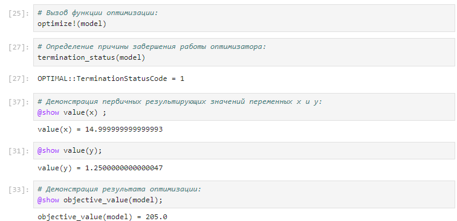{ #fig:002 width=50% }

##

**2.** Далее пререшла к примеру "Векторизованные ограничения и целевая функция оптимизации". Можно добавить ограничения и цель в JuMP, используя векторизованную линейную алгебру.

##

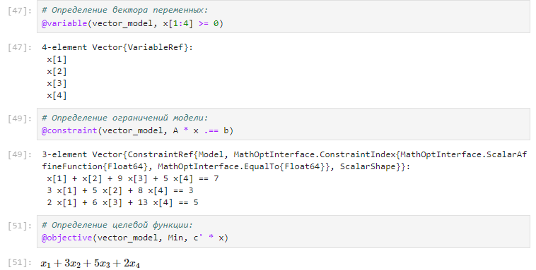{ #fig:003 width=50% }

##

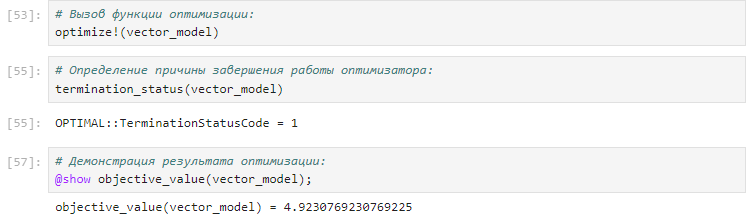{ #fig:004 width=50% }

##

**3.** Рассмотрела пример "Оптимизация рациона питания".

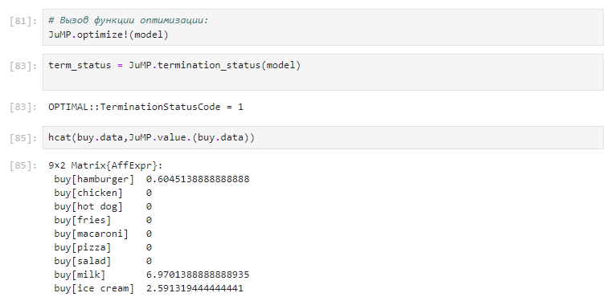{ #fig:005 width=50% }

##

**4.** Попробовала пример с графиком "Портфельные инвестиции".

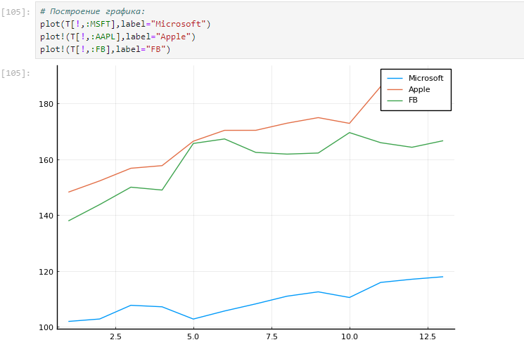{ #fig:006 width=50% }

##

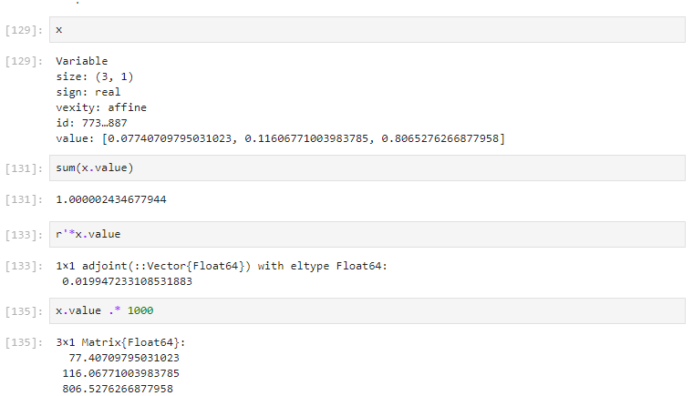{ #fig:007 width=50% }

##

**5.** И в конце повторила пример по востановлению ихображения. Предположим есть изображение, на котором были изменены некоторые пиксели. Требуется восстановить неизвестные пиксели путём решения задачи оптимизации.

##

**6.** Перешла к заданиям для самостоятельной работы.

- Задание 1 

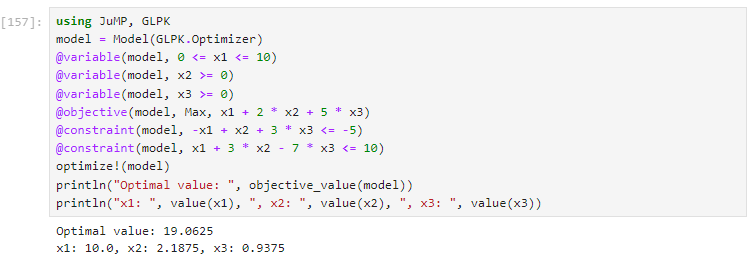{ #fig:008 width=50% }

##
 
- Задание 2 

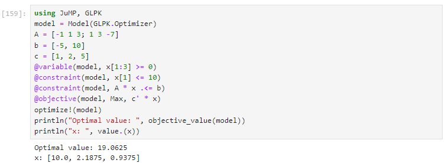{ #fig:009 width=50% }

##

- Задание 3 

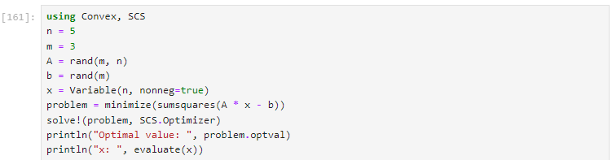{ #fig:010 width 50% }

##

- Задание 4

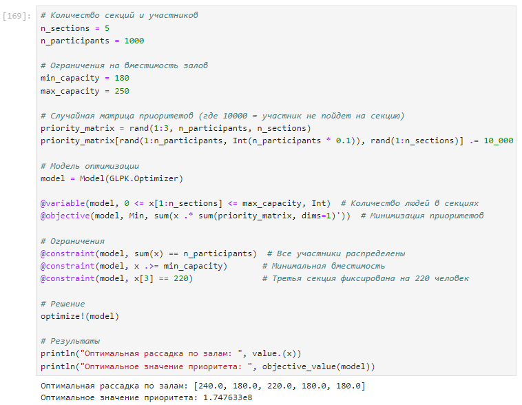{ #fig:011 width=50% }

##

- Задание 5  

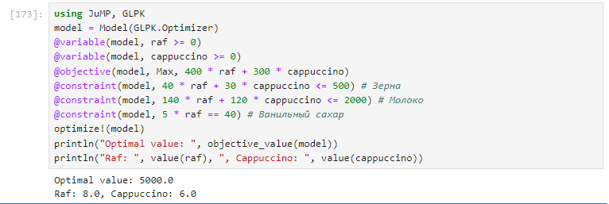{ #fig:012 width=50% }

# Вывод

Освоила пакеты Julia для решения задач оптимизации.