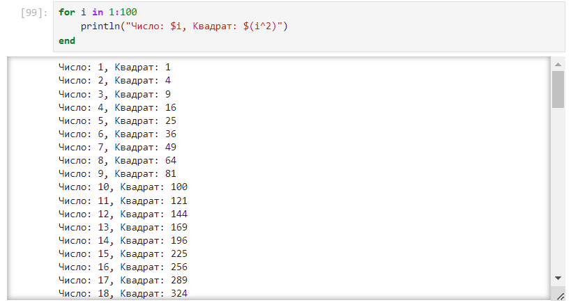

---
## Front matter
title: "Отчет по лабораторной работе №3"
subtitle: "Управляющие структуры"
author: "Легиньких Галина Андреевна"

## Generic otions
lang: ru-RU
toc-title: "Содержание"
## Pdf output format
toc: true # Table of contents
toc-depth: 2
lof: true # List of figures
lot: true # List of tables
fontsize: 12pt
linestretch: 1.5
papersize: a4
documentclass: scrreprt
## I18n polyglossia
polyglossia-lang:
  name: russian
  options:
  - spelling=modern
  - babelshorthands=true
polyglossia-otherlangs:
  name: english
## I18n babel
babel-lang: russian
babel-otherlangs: english
## Fonts
mainfont: PT Serif
romanfont: PT Serif
sansfont: PT Sans
monofont: PT Mono
mainfontoptions: Ligatures=TeX
romanfontoptions: Ligatures=TeX
sansfontoptions: Ligatures=TeX,Scale=MatchLowercase
monofontoptions: Scale=MatchLowercase,Scale=0.9
## Biblatex
biblatex: true
biblio-style: "gost-numeric"
biblatexoptions:
  - parentracker=true
  - backend=biber
  - hyperref=auto
  - language=auto
  - autolang=other*
  - citestyle=gost-numeric
## Pandoc-crossref LaTeX customization
figureTitle: "Рис."
tableTitle: "Таблица"
listingTitle: "Листинг"
lofTitle: "Список иллюстраций"
lotTitle: "Список таблиц"
lolTitle: "Листинги"
## Misc options
indent: true
header-includes:
  - \usepackage{indentfirst}
  - \usepackage{float} # keep figures where there are in the text
  - \floatplacement{figure}{H} # keep figures where there are in the text
---

# Цель работы

Основная цель работы — освоить применение циклов функций и сторонних для Julia пакетов для решения задач линейной алгебры и работы с матрицами.

# Задание

1. Используя Jupyter Lab, повторите примеры из раздела 2.2.
2. Выполните задания для самостоятельной работы (раздел 2.4).

# Выполнение лабораторной работы

**1.** Для начала я изучила видеоматериал к лекции и повторила примеры из раздела 3.2. Сначало это были циклы while и for. Для различных операций, связанных с перебором индексируемых элементов структур данных, традиционно используются циклы while и for. (рис. [-@fig:001]) (рис. [-@fig:002]) (рис. [-@fig:003])

{ #fig:001 width=70% }

{ #fig:002 width=70% }

{ #fig:003 width=70% }

**2.** Условные выражения. Довольно часто при решении задач требуется проверить выполнение тех или иных условий. Для этого используют условные выражения. Повторила синтаксис условных выражений с тернарными операторами. (рис. [-@fig:004])

{ #fig:004 width=70% }

**3.** Далее перешла к функциям. Julia дает нам несколько разных способов написать функцию. Первый требует ключевых
слов function и end. (рис. [-@fig:005])

{ #fig:005 width=70% }

В качестве альтернативы, можно объявить любую из выше определённых функций
в одной строке. (рис. [-@fig:006])

{ #fig:006 width=70% }

Наконец, можно объявить выше определённые функции как "анонимные". (рис. [-@fig:007])

{ #fig:007 width=70% }

По соглашению в Julia функции, сопровождаемые восклицательным знаком, изменяют свое содержимое, а функции без восклицательного знака не делают этого. (рис. [-@fig:008])

{ #fig:008 width=70% }

В Julia функция map является функцией высшего порядка, которая принимает функцию в качестве одного из своих входных аргументов и применяет эту функцию к каждому элементу структуры данных, которая ей передаётся также в качестве аргумента. (рис. [-@fig:009])

{ #fig:009 width=70% }

Функция broadcast — ещё одна функция высшего порядка в Julia, представляющая собой обобщение функции map.Функция broadcast() будет пытаться привести все объекты к общему измерению, map() будет напрямую применять данную функцию поэлементно. (рис. [-@fig:010])

{ #fig:010 width=70% }

**4.** Julia имеет более 2000 зарегистрированных пакетов, что делает их огромной частью экосистемы Julia. Научилась загружать пакеты. (рис. [-@fig:011])

{ #fig:011 width=70% }

И использовать их. (рис. [-@fig:012])

{ #fig:012 width=70% }

**5.** Перешла к заданиям для самостоятельной работы. Дублировать задания не буду, они слишком большие. Нумерация соответствует нумерации в файле задания. 

- Задание 1.1 с помощью while (рис. [-@fig:013])

{ #fig:013 width=70% }

- Задание 1.1 с помощью for (рис. [-@fig:014])

{ #fig:014 width=70% }

- Задание 1.2 (рис. [-@fig:015])

{ #fig:015 width=70% }

- Задание 1.3 (рис. [-@fig:016])

{ #fig:016 width=70% }

- Задание 2 (рис. [-@fig:017])

{ #fig:017 width=70% }

- Задание 3 (рис. [-@fig:018])

{ #fig:018 width=70% }

- Задание 4 (рис. [-@fig:019])

{ #fig:019 width=70% }

- Задание 5 (рис. [-@fig:020])

{ #fig:020 width=70% }

- Задание 6 (рис. [-@fig:021])

{ #fig:021 width=70% }

- Задание 7.0 (рис. [-@fig:022])

{ #fig:022 width=70% }

- Задание 7.1 (рис. [-@fig:023])

{ #fig:023 width=70% }

- Задание 7.2 (рис. [-@fig:024])

{ #fig:024 width=70% }

- Задание 7.3 (рис. [-@fig:025])

{ #fig:025 width=70% }

- Задание 7.4 (рис. [-@fig:026])

{ #fig:026 width=70% }

- Задание 8.1 - 8.2 (рис. [-@fig:027])

{ #fig:027 width=70% }

- Задание 8.3 - 8.4 (рис. [-@fig:028])

{ #fig:028 width=70% }

- Задание 8.5 (рис. [-@fig:029])

{ #fig:029 width=70% }

- Задание 9 (рис. [-@fig:030])

{ #fig:030 width=70% }

- Задание 10.1 - 10.2 (рис. [-@fig:031])

{ #fig:031 width=70% }

- Задание 10.3 (рис. [-@fig:032])

{ #fig:032 width=70% }

- Задание 11 (рис. [-@fig:033])

{ #fig:033 width=70% }

# Вывод

Освоила применение циклов функций и сторонних для Julia пакетов для решения задач линейной алгебры и работы с матрицами.