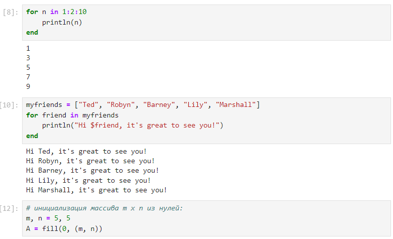

---
## Front matter
lang: ru-RU
title: Лабораторная работа №3
subtitle: "Управляющие структуры"
author:
  - Легиньких Г.А.
institute:
  - Российский университет дружбы народов, Москва, Россия

## i18n babel
babel-lang: russian
babel-otherlangs: english

## Formatting pdf
toc: false
toc-title: Содержание
slide_level: 2
aspectratio: 169
section-titles: true
theme: metropolis
header-includes:
 - \metroset{progressbar=frametitle,sectionpage=progressbar,numbering=fraction}
 - '\makeatletter'
 - '\beamer@ignorenonframefalse'
 - '\makeatother'
---

# Информация

## Докладчик

:::::::::::::: {.columns align=center}
::: {.column width="70%"}

  * Легиньких Галина Андреевна
  * НФИбд-02-21
  * Российский университет дружбы народов
  * [1032216447@pfur.ru](mailto:1032216447@pfur.ru)
  * <https://github.com/galeginkikh>

:::
::: {.column width="30%"}

:::
::::::::::::::

# Основная информация

## Цель работы

Основная цель работы — освоить применение циклов функций и сторонних для Julia пакетов для решения задач линейной алгебры и работы с матрицами.

## Задание

1. Используя Jupyter Lab, повторите примеры из раздела 2.2.
2. Выполните задания для самостоятельной работы (раздел 2.4).

# Выполнение

## Циклы while и for

Для начала я изучила видеоматериал к лекции и повторила примеры из раздела 3.2. Сначало это были циклы while и for. Для различных операций, связанных с перебором индексируемых элементов структур данных, традиционно используются циклы while и for.

{ #fig:001 width=40% }

## Циклы while и for

{ #fig:002 width=40% }

## Условные выражения

Довольно часто при решении задач требуется проверить выполнение тех или иных условий. Для этого используют условные выражения. Повторила синтаксис условных выражений с тернарными операторами.

{ #fig:004 width=40% }

## Функции способ 1

Далее перешла к функциям. Julia дает нам несколько разных способов написать функцию. Первый требует ключевых
слов function и end.

{ #fig:005 width=40% }

## Функции способ 2

В качестве альтернативы, можно объявить любую из выше определённых функций
в одной строке.

{ #fig:006 width=50% }

## Функции способ 3

Наконец, можно объявить выше определённые функции как "анонимные".

{ #fig:007 width=50% }

## sort as !sort

По соглашению в Julia функции, сопровождаемые восклицательным знаком, изменяют свое содержимое, а функции без восклицательного знака не делают этого.

{ #fig:008 width=40% }

## map

В Julia функция map является функцией высшего порядка, которая принимает функцию в качестве одного из своих входных аргументов и применяет эту функцию к каждому элементу структуры данных, которая ей передаётся также в качестве аргумента.

{ #fig:009 width=50% }

## broadcast

Функция broadcast — ещё одна функция высшего порядка в Julia, представляющая собой обобщение функции map.Функция broadcast() будет пытаться привести все объекты к общему измерению, map() будет напрямую применять данную функцию поэлементно.

{ #fig:010 width=20% }

## Пакеты

Julia имеет более 2000 зарегистрированных пакетов, что делает их огромной частью экосистемы Julia. Научилась загружать пакеты.

{ #fig:011 width=40% }

## Задание для самостоятельной работы (while)

- Задание 1.1 с помощью while

{ #fig:013 width=40% }

## Задание для самостоятельной работы (for)

- Задание 1.1 с помощью for

{ #fig:014 width=40% }

## Функции и Условные выражения

- Задание 2 

{ #fig:017 width=40% }

## Функции способ 2 и 3

- Задание 3

{ #fig:018 width=40% }

## map и broadcast

- Задание 4

{ #fig:019 width=40% }

## for и Условные выражения

- Задание 7.1

{ #fig:023 width=70% }

# Вывод

Освоила применение циклов функций и сторонних для Julia пакетов для решения задач линейной алгебры и работы с матрицами.